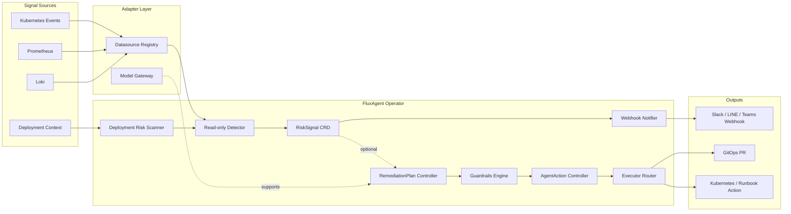

# FluxAgent

Kubernetes-native AI SRE Agent Operator for proactive risk detection, RCA assistance, and guarded remediation.

FluxAgent turns Kubernetes Events, Prometheus metrics, Loki logs, and deployment context into `RiskSignal`, `RemediationPlan`, and guarded `AgentAction` workflows.

Core logic is designed to stay adapter-neutral: Kubernetes, Prometheus, Loki, and model vendors are integrations, not the product's hard-coded identity.

## Why FluxAgent

- Kubernetes-native: CRD + Controller + Reconcile Loop
- Read-only first: the default `v0.1` path does not mutate production
- Provider-neutral: OpenAI, Claude, Gemini, Bedrock, Local Model
- Observability-native: Prometheus, Loki, Kubernetes Events, OpenTelemetry
- Guardrails-first: policy, dry-run, approval, and audit before execution
- GitOps-first: prefer pull requests over direct production patching
- Optional adapters: Prometheus, Loki, model APIs, and remediation remain opt-in
- Operator-first investigation: `InvestigationRequest` turns ad-hoc RCA into a first-class CRD and CLI flow

## Architecture



Read the long-form architecture in [docs/architecture/overview.md](/Users/czhuang/Chongzhe-workspace/HomeLab/FluxSeer/FluxAgent/docs/architecture/overview.md:1).

## Runtime Modes

### `v0.1` Read-only RiskSignal Operator

This is the default mode when you run `cmd/manager`.

- watches annotated `Deployment` resources and `RiskRule` resources
- queries Kubernetes Events
- optionally queries Prometheus and Loki when manager env vars or `DataSource` resources are configured
- creates `RiskSignal`
- sends webhook notifications
- does not create `RemediationPlan` or `AgentAction`

## Dependency Matrix

FluxAgent distinguishes runtime, compile-time, and deployment dependency.

| Integration | Runtime | Compile-time | Deployment | Current Role |
| --- | --- | --- | --- | --- |
| Kubernetes | required for operator mode | yes in controllers and CRD API | installed by FluxAgent manifests | control plane and default event source |
| Kubernetes Events | enabled by default | yes via Kubernetes adapter | no extra stack required | default datasource |
| Prometheus | optional | isolated to adapter packages | not installed by default | metrics datasource |
| Loki | optional | isolated to adapter packages | not installed by default | logs datasource |
| External model APIs | optional | isolated to model-provider packages | not installed by default | RCA enrichment |
| Remediation executors | optional | isolated to executor packages | disabled by default | guarded expansion path |

The longer-form design constraints are documented in [docs/architecture/dependency-neutrality.md](/Users/czhuang/Chongzhe-workspace/HomeLab/FluxSeer/FluxAgent/docs/architecture/dependency-neutrality.md:1).

### Optional Guarded Remediation

Enable this explicitly with `--enable-remediation=true`.

- `RiskSignal` can generate `RemediationPlan`
- guardrails decide auto-approve / waiting approval / reject
- approved `AgentAction` routes through executor adapters
- execution remains separated from AI reasoning

## Core CRDs

- `RiskRule`: read-only detection rule definition
- `InvestigationRequest`: ad-hoc investigation request with RCA and optional `RiskSignal` promotion
- `DataSource`: optional datasource runtime configuration
- `ModelProvider`: provider-neutral reasoning backend configuration
- `RiskSignal`: observed risk with evidence and confidence
- `RemediationPlan`: proposed, reviewable mitigation workflow
- `AgentAction`: guarded executable action with approval context

See:

- [config/samples/risk-rule.yaml](/Users/czhuang/Chongzhe-workspace/HomeLab/FluxSeer/FluxAgent/config/samples/risk-rule.yaml:1)
- [config/samples/investigation-request.yaml](/Users/czhuang/Chongzhe-workspace/HomeLab/FluxSeer/FluxAgent/config/samples/investigation-request.yaml:1)
- [config/samples/investigation-queries.yaml](/Users/czhuang/Chongzhe-workspace/HomeLab/FluxSeer/FluxAgent/config/samples/investigation-queries.yaml:1)
- [config/samples/datasource-prometheus.yaml](/Users/czhuang/Chongzhe-workspace/HomeLab/FluxSeer/FluxAgent/config/samples/datasource-prometheus.yaml:1)
- [config/samples/datasource-loki.yaml](/Users/czhuang/Chongzhe-workspace/HomeLab/FluxSeer/FluxAgent/config/samples/datasource-loki.yaml:1)
- [config/samples/datasource-kubernetes-events.yaml](/Users/czhuang/Chongzhe-workspace/HomeLab/FluxSeer/FluxAgent/config/samples/datasource-kubernetes-events.yaml:1)
- [config/samples/model-provider.yaml](/Users/czhuang/Chongzhe-workspace/HomeLab/FluxSeer/FluxAgent/config/samples/model-provider.yaml:1)
- [config/samples/model-provider-local.yaml](/Users/czhuang/Chongzhe-workspace/HomeLab/FluxSeer/FluxAgent/config/samples/model-provider-local.yaml:1)
- [config/samples/model-provider-openai.yaml](/Users/czhuang/Chongzhe-workspace/HomeLab/FluxSeer/FluxAgent/config/samples/model-provider-openai.yaml:1)
- [config/samples/model-provider-gemini.yaml](/Users/czhuang/Chongzhe-workspace/HomeLab/FluxSeer/FluxAgent/config/samples/model-provider-gemini.yaml:1)
- [config/samples/model-provider-claude.yaml](/Users/czhuang/Chongzhe-workspace/HomeLab/FluxSeer/FluxAgent/config/samples/model-provider-claude.yaml:1)
- [config/samples/model-provider-openai-secret.yaml](/Users/czhuang/Chongzhe-workspace/HomeLab/FluxSeer/FluxAgent/config/samples/model-provider-openai-secret.yaml:1)
- [config/samples/model-provider-gemini-secret.yaml](/Users/czhuang/Chongzhe-workspace/HomeLab/FluxSeer/FluxAgent/config/samples/model-provider-gemini-secret.yaml:1)
- [config/samples/model-provider-claude-secret.yaml](/Users/czhuang/Chongzhe-workspace/HomeLab/FluxSeer/FluxAgent/config/samples/model-provider-claude-secret.yaml:1)
- [config/samples/risk-signal.yaml](/Users/czhuang/Chongzhe-workspace/HomeLab/FluxSeer/FluxAgent/config/samples/risk-signal.yaml:1)
- [config/samples/remediation-plan.yaml](/Users/czhuang/Chongzhe-workspace/HomeLab/FluxSeer/FluxAgent/config/samples/remediation-plan.yaml:1)
- [config/samples/agent-action.yaml](/Users/czhuang/Chongzhe-workspace/HomeLab/FluxSeer/FluxAgent/config/samples/agent-action.yaml:1)

## Repo Layout

- `cmd/manager`: canonical controller-runtime manager entrypoint
- `internal/controllers`: Kubernetes reconcilers
- `internal/detector`: read-only signal detection logic
- `internal/datasource`: Prometheus, Loki, Kubernetes Events, and other datasource adapters
- `internal/datasourceconfig`: `DataSource` resource loading and adapter construction
- `internal/model`: provider-neutral model gateway abstractions
- `internal/guardrails`: approval and policy checks
- `internal/executor`: execution routing
- `examples/kind`: local demo flow

## Quickstart

### Local Demo Pipeline

```bash
cd FluxAgent
GOWORK=off go run ./cmd/fluxagent
GOWORK=off go test ./...
make verify-v0.2-alpha
```

### Operator-First Investigation

Create an ad-hoc `InvestigationRequest` from CLI:

```bash
GOWORK=off go run ./cmd/fluxagent investigate deployment open-api \
  -n prod \
  --query-file config/samples/investigation-queries.yaml \
  --question "Why did open-api latency increase after the latest rollout?" \
  --provider heuristic-provider \
  --create-risk-signal \
  --wait
```

This writes an `InvestigationRequest` CRD, waits for RCA completion, and optionally promotes the result into `RiskSignal`.

See:

- [docs/tutorials/investigate-workload.md](/Users/czhuang/Chongzhe-workspace/HomeLab/FluxSeer/FluxAgent/docs/tutorials/investigate-workload.md:1)
- [docs/crd-reference/investigationrequest.md](/Users/czhuang/Chongzhe-workspace/HomeLab/FluxSeer/FluxAgent/docs/crd-reference/investigationrequest.md:1)

### Run the Operator

```bash
cd FluxAgent
GOWORK=off go run ./cmd/manager
```

### Deploy to a Cluster

```bash
cd FluxAgent
kubectl create namespace fluxagent-system
kubectl apply -k config/default
```

### Enable Hosted RCA Providers

Hosted OpenAI, Gemini, and Claude provider usage is documented in:

- [docs/tutorials/enable-hosted-model-providers.md](/Users/czhuang/Chongzhe-workspace/HomeLab/FluxSeer/FluxAgent/docs/tutorials/enable-hosted-model-providers.md:1)

## kind Demo

```bash
cd FluxAgent
make demo-up
make inject-fault
make demo-status
make demo-degrade-missing-datasource
make demo-degrade-capability-mismatch
make demo-degrade-provider-auth-failed
make demo-degrade-all
make demo-reset-riskrule
make verify-e2e-kind
make verify-investigation-kind
make demo-down
```

For recording, you can extend the pause between `demo-degrade-all` sections:

```bash
make demo-degrade-all DEMO_PAUSE_SECONDS=6
```

This demo deploys:

- FluxAgent manager
- a sample app selected by `RiskRule`
- a sample heuristic `ModelProvider`
- `DataSource` resources for Prometheus, Loki, and Kubernetes Events
- a fake observability service that simulates Prometheus, Loki, and webhook outputs

The demo uses fake observability on purpose. FluxAgent does not require installing Prometheus or Loki just to validate the read-only path.

`make demo-status` now shows the core condition surfaces for:

- `DataSource`
- `RiskRule`
- `RiskSignal`

The demo also includes degraded-case helpers so you can intentionally trigger:

- `DataSourceNotFound`
- `CapabilityMismatch`

For a full end-to-end validation of the kind flow, run:

```bash
make verify-e2e-kind
```

`verify-e2e-kind` is the main `v0.2 alpha` release gate. It now covers both:

- the read-only `RiskRule -> RiskSignal` path
- the operator-first `InvestigationRequest -> RCA -> RiskSignal` path

For the operator-first investigation path, run:

```bash
make verify-investigation-kind
```

This target will:

- create the demo cluster
- wait for manager and demo workloads to become ready
- inject a fault
- assert that a `RiskSignal` exists
- assert that `status.rcaSummary` is populated
- assert that the fake webhook received a notification
- assert degraded conditions for missing datasource and capability mismatch
- clean up the kind cluster automatically

## Current Scope

FluxAgent is already a working open-source skeleton, but it is not yet a production-grade remediation platform.

Implemented today:

- read-only `RiskSignal` generation flow
- `InvestigationRequest` ad-hoc RCA flow with configurable `queries[]`
- optional `InvestigationRequest -> RiskSignal` promotion path
- controller-runtime manager and reconcilers
- Prometheus, Loki, and Kubernetes Events adapter implementations
- webhook notification flow
- provider-neutral model abstractions
- heuristic and local endpoint model-provider runtime paths
- hosted OpenAI, Gemini, and Claude model-provider runtime adapters
- optional guarded remediation path
- kind demo scaffolding

Not implemented yet:

- production-hardened auth, retries, and backoff for all adapters
- production-hardened vendor auth, retry, and response-governance coverage
- GitOps PR backends and approval UX
- admission policies and richer multi-cluster support

## Documentation

- [docs/README.md](/Users/czhuang/Chongzhe-workspace/HomeLab/FluxSeer/FluxAgent/docs/README.md:1)
- [docs/architecture/overview.md](/Users/czhuang/Chongzhe-workspace/HomeLab/FluxSeer/FluxAgent/docs/architecture/overview.md:1)
- [docs/architecture/dependency-neutrality.md](/Users/czhuang/Chongzhe-workspace/HomeLab/FluxSeer/FluxAgent/docs/architecture/dependency-neutrality.md:1)
- [docs/architecture/read-only-flow.md](/Users/czhuang/Chongzhe-workspace/HomeLab/FluxSeer/FluxAgent/docs/architecture/read-only-flow.md:1)
- [docs/architecture/remediation-flow.md](/Users/czhuang/Chongzhe-workspace/HomeLab/FluxSeer/FluxAgent/docs/architecture/remediation-flow.md:1)
- [docs/crd-reference/risksignal.md](/Users/czhuang/Chongzhe-workspace/HomeLab/FluxSeer/FluxAgent/docs/crd-reference/risksignal.md:1)
- [docs/crd-reference/datasource.md](/Users/czhuang/Chongzhe-workspace/HomeLab/FluxSeer/FluxAgent/docs/crd-reference/datasource.md:1)
- [docs/adapters/prometheus.md](/Users/czhuang/Chongzhe-workspace/HomeLab/FluxSeer/FluxAgent/docs/adapters/prometheus.md:1)
- [docs/tutorials/quickstart-kind.md](/Users/czhuang/Chongzhe-workspace/HomeLab/FluxSeer/FluxAgent/docs/tutorials/quickstart-kind.md:1)
- [docs/github-repo.md](/Users/czhuang/Chongzhe-workspace/HomeLab/FluxSeer/FluxAgent/docs/github-repo.md:1)
- [ROADMAP.md](/Users/czhuang/Chongzhe-workspace/HomeLab/FluxSeer/FluxAgent/ROADMAP.md:1)
- [docs/open-source-positioning.md](/Users/czhuang/Chongzhe-workspace/HomeLab/FluxSeer/FluxAgent/docs/open-source-positioning.md:1)

## License

Apache-2.0. See [LICENSE](/Users/czhuang/Chongzhe-workspace/HomeLab/FluxSeer/FluxAgent/LICENSE:1).
