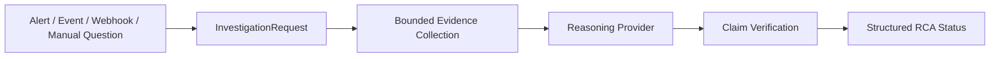
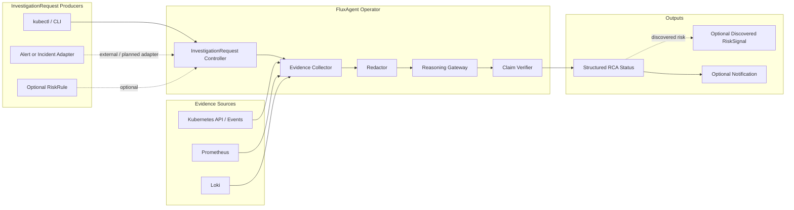

# FluxAgent

Kubernetes-native SRE RCA control plane for teams that want explicit, auditable, and security-first AI-assisted investigation.

Current release: `v0.3.0-beta.1`

Status: `v0.3 RCA contract frozen, beta published, provenance verified`

FluxAgent turns production signals and operator questions into structured, evidence-linked RCA resources in Kubernetes.

FluxAgent exists for platform teams that need to answer:

```text
What evidence did this RCA use?
Which claims are supported, inferred, or missing evidence?
Which datasources failed or degraded?
Can this investigation be audited, reproduced from recorded query metadata, and compared later?
```

FluxAgent is the Kubernetes control plane and audit contract around RCA. It is not an all-in-one monitoring stack, not a free-form cluster agent, and not an autonomous production remediation system.

FluxAgent does not grant reasoning providers unrestricted cluster access. It sends only bounded, normalized, and redacted evidence collected through declared investigation policies and datasource capabilities.

## Why FluxAgent

FluxAgent is built around four product decisions:

- Evidence-linked RCA over free-form incident prose.
- Kubernetes CRD status as the durable workflow and audit surface.
- Dependency-neutral evidence collection from existing Kubernetes, Prometheus, and Loki sources.
- Read-only default behavior with heuristic RCA available without external API calls.

This positioning is intentionally narrower than a general AI SRE agent. `RiskRule` is an optional bootstrap signal source, not an attempt to replace Alertmanager or own all Kubernetes detection. Remediation CRDs are optional extensions, not the default product path.

## Minimum Flow



The current `v0.2` release supports the operator-first RCA path:

```text
InvestigationRequest
-> Kubernetes Events / Prometheus / Loki evidence
-> heuristic, OpenAI, Claude, or Gemini RCA
-> structured status with compact evidence references
```

The frozen `v0.3` RCA contract hardens claim verification into a stricter audit surface:

```text
Claim
-> Evidence reference
-> Verification status
```

## Example RCA Status

The v0.3 status contract makes important RCA claims machine-checkable instead of returning only Markdown prose:

```yaml
status:
  phase: Completed
  verdict:
    summary: "checkout is failing because it is configured for the wrong Redis port."
    rootCauseEntity:
      apiVersion: apps/v1
      kind: Deployment
      namespace: prod
      name: checkout
    rootCauseType: ConfigurationMismatch
    confidence: 0.91
  evidenceRefs:
    - id: evidence-001
      kind: Log
      source: prod-loki
      summary: "checkout attempted Redis connections on port 6379."
      query: "{namespace=\"prod\",app=\"checkout\"} |= \"redis\""
      queryDigest: sha256:31d9...
      timeRange:
        start: "2026-07-27T06:00:00Z"
        end: "2026-07-27T06:15:00Z"
      collectedAt: "2026-07-27T06:16:04Z"
      contentDigest: sha256:77aa...
      redacted: true
      truncated: false
    - id: evidence-002
      kind: KubernetesObject
      source: kubernetes-api
      summary: "redis Service exposes port 6380."
      contentDigest: sha256:ab42...
      redacted: true
      truncated: false
  claims:
    - id: claim-001
      statement: "checkout connects to Redis on port 6379."
      evidenceRefs:
        - evidence-001
      verification: Supported
    - id: claim-002
      statement: "redis Service exposes port 6380."
      evidenceRefs:
        - evidence-002
      verification: Supported
  alternativeHypotheses:
    - statement: "Redis is unavailable."
      disposition: Rejected
      evidenceRefs:
        - evidence-003
  missingEvidence:
    - source: traces
      reason: DataSourceNotConfigured
  degradation:
    partial: true
    unavailableSources:
      - loki-secondary
  execution:
    provider: heuristic-provider
    attempts: 1
    durationSeconds: 4
```

Implemented in `v0.2.0-beta.1`:

- compatibility RCA status fields: `summary`, `hypothesis`, `confidence`, `provider`
- compact `evidenceRefs`
- `linkedRiskSignalRef`
- workflow and readiness conditions

Target for `v0.3`:

- `verdict`
- `claims`
- `alternativeHypotheses`
- `missingEvidence`
- `degradation`
- `execution`
- richer evidence provenance and claim verification semantics

`confidence` is a provider- or verifier-derived ranking score, not a calibrated probability of correctness. `RiskSignal.spec.confidence`, `RiskSignal.status.rcaCauses[].confidence`, and `RemediationPlan.spec.confidence` use integer scores from `0` to `100`; the v0.3 `InvestigationRequest.status.verdict.confidence` contract uses a normalized score from `0.0` to `1.0`.

## Security Posture

FluxAgent is security-first by default:

- runs read-only unless guarded remediation is explicitly enabled
- uses heuristic RCA without external model calls by default
- requires explicit `ModelProvider` and provider credentials before sending evidence to OpenAI, Claude, or Gemini
- redacts provider-bound evidence before hosted API calls
- does not persist raw observability payloads, model prompts, provider responses, Kubernetes Secret values, tokens, or authorization headers
- does not package CLI agent runtimes, developer-local OAuth caches, or subscription sessions as cluster credentials
- does not automatically inspect every namespace; scope is declared through `RiskRule`, `DataSource`, and `InvestigationRequest`

This trades some first-run convenience for lower default resource usage, stronger auditability, and clearer control over what data can leave the cluster.

## Architecture

Target RCA architecture:



Current `v0.2` implements bounded evidence collection, provider reasoning, status conditions, compact evidence references, and the first structured RCA status fields. Evidence-linked claim verification is the `v0.3` hardening target.

In `v0.2`, external alerting systems integrate by creating `InvestigationRequest` resources through the Kubernetes API. Built-in alert receivers, webhook ingress, Kubernetes Event to `InvestigationRequest` adapters, and `RiskSignal`-triggered reinvestigation are future producer adapters. Reinvestigation must be policy-gated to avoid loops.

Read the long-form architecture in [docs/architecture/overview.md](docs/architecture/overview.md).

## Runtime Modes

### Read-only RCA Control Plane

This is the default mode when you run the operator.

- accepts `InvestigationRequest` objects for ad-hoc or externally triggered RCA
- collects bounded evidence from declared datasources
- redacts evidence before hosted provider calls
- stores RCA output in CRD status
- may emit a newly discovered `RiskSignal` from optional bootstrap rules or investigation findings
- does not create `RemediationPlan` or `AgentAction` unless guarded remediation is explicitly enabled

## Dependency Matrix

FluxAgent distinguishes runtime, compile-time, and deployment dependency.

| Integration | Runtime | Compile-time | Deployment | Current Role |
| --- | --- | --- | --- | --- |
| Kubernetes | required for operator mode | yes in controllers and CRD API | installed by FluxAgent manifests | control plane and default event source |
| Kubernetes Events | enabled by default | yes via Kubernetes adapter | no extra stack required | default datasource |
| Prometheus | optional | isolated to adapter packages | not installed by default | metrics datasource |
| Loki | optional | isolated to adapter packages | not installed by default | logs datasource |
| External model APIs | optional | isolated to model-provider packages | not installed by default | RCA enrichment |
| Remediation executors | optional | isolated to executor packages | disabled by default | guarded expansion path |

The longer-form design constraints are documented in [docs/architecture/dependency-neutrality.md](docs/architecture/dependency-neutrality.md).

## Optional Extensions

### Bootstrap Rule Packs

FluxAgent includes an optional Kubernetes Events rule pack for first-run bootstrap. It helps a new install surface common workload failure events without requiring users to write their first `RiskRule` by hand, but it is not intended to replace Alertmanager or a production detection platform.

See [docs/helm-rulepacks.md](docs/helm-rulepacks.md) for configuration and supported rules.

### Guarded Remediation

Enable this explicitly with `--enable-remediation=true`.

- `RiskSignal` can generate `RemediationPlan`
- guardrails decide auto-approve / waiting approval / reject
- approved `AgentAction` routes through executor adapters
- execution remains separated from AI reasoning

## Core CRDs

- `RiskRule`: read-only detection rule definition
- `InvestigationRequest`: ad-hoc investigation request with structured RCA status and optional discovered `RiskSignal`
- `DataSource`: optional datasource runtime configuration
- `ModelProvider`: provider-neutral reasoning backend configuration
- `RiskSignal`: observed risk with evidence and confidence
- `RemediationPlan`: experimental proposed mitigation workflow
- `AgentAction`: experimental guarded executable action with approval context

`ModelProvider` is the frozen `v1alpha1` API name for reasoning backends, including the built-in heuristic path.

The frozen v0.3 API group is `aiops.platform/v1alpha1`. Any future API-group or resource rename requires an explicit migration path; it is not treated as a cosmetic change after the v0.3 schema freeze.

See:

- [config/samples/risk-rule.yaml](config/samples/risk-rule.yaml)
- [config/samples/investigation-request.yaml](config/samples/investigation-request.yaml)
- [config/samples/investigation-queries.yaml](config/samples/investigation-queries.yaml)
- [config/samples/datasource-prometheus.yaml](config/samples/datasource-prometheus.yaml)
- [config/samples/datasource-loki.yaml](config/samples/datasource-loki.yaml)
- [config/samples/datasource-kubernetes-events.yaml](config/samples/datasource-kubernetes-events.yaml)
- [config/samples/model-provider.yaml](config/samples/model-provider.yaml)
- [config/samples/model-provider-openai.yaml](config/samples/model-provider-openai.yaml)
- [config/samples/model-provider-gemini.yaml](config/samples/model-provider-gemini.yaml)
- [config/samples/model-provider-claude.yaml](config/samples/model-provider-claude.yaml)
- [config/samples/model-provider-openai-secret.yaml](config/samples/model-provider-openai-secret.yaml)
- [config/samples/model-provider-gemini-secret.yaml](config/samples/model-provider-gemini-secret.yaml)
- [config/samples/model-provider-claude-secret.yaml](config/samples/model-provider-claude-secret.yaml)
- [config/samples/risk-signal.yaml](config/samples/risk-signal.yaml)
- [config/samples/remediation-plan.yaml](config/samples/remediation-plan.yaml)
- [config/samples/agent-action.yaml](config/samples/agent-action.yaml)

## Repo Layout

- `cmd/manager`: canonical controller-runtime manager entrypoint
- `internal/controllers`: Kubernetes reconcilers
- `internal/detector`: read-only signal detection logic
- `internal/datasource`: Prometheus, Loki, Kubernetes Events, and other datasource adapters
- `internal/datasourceconfig`: `DataSource` resource loading and adapter construction
- `internal/model`: provider-neutral model gateway abstractions
- `internal/guardrails`: approval and policy checks
- `internal/executor`: execution routing
- `examples/kind`: local demo flow

## Quickstart

### Install The Beta Chart

Current `v0.2.0-beta.1` distribution uses the FluxSeer Harbor registry. GHCR is the planned canonical public registry, but it should not be used in install snippets until the chart and images are published there with anonymous pull enabled.

```bash
helm install fluxagent \
  oci://test-harbor.fluxseer.com/fluxseer/fluxagent/charts/kube-ai-sre \
  --version 0.2.0-beta.1 \
  --namespace fluxagent-system \
  --create-namespace

kubectl -n fluxagent-system rollout status deployment/fluxagent-controller-manager
```

### Install Smoke Investigation

Create a Kubernetes Events datasource and a first smoke investigation. Leaving `modelProviderRef` empty uses the built-in heuristic provider, so this path does not require OpenAI, Claude, or Gemini credentials:

```bash
kubectl apply -f - <<'EOF'
apiVersion: aiops.platform/v1alpha1
kind: DataSource
metadata:
  name: kubernetes-events
  namespace: fluxagent-system
spec:
  type: kubernetesEvents
---
apiVersion: aiops.platform/v1alpha1
kind: InvestigationRequest
metadata:
  name: investigate-fluxagent
  namespace: fluxagent-system
spec:
  target:
    namespace: fluxagent-system
    kind: Deployment
    name: fluxagent-controller-manager
    apiVersion: apps/v1
  timeRange:
    lookback: 15m
  question: |
    Is the FluxAgent controller healthy after install?
  dataSources:
    - name: kubernetes-events
  mode: readOnly
EOF

kubectl -n fluxagent-system wait investigationrequest/investigate-fluxagent \
  --for=condition=Ready \
  --timeout=120s

kubectl -n fluxagent-system get investigationrequest investigate-fluxagent -o yaml
```

This writes an `InvestigationRequest`, collects bounded Kubernetes evidence, and stores the RCA in compatibility status fields plus compact `status.evidenceRefs`.

`Ready=True` means the workflow produced a consumable terminal status. It does not mean a root cause was confirmed. `RCAReady=True` means an RCA result is available. It does not indicate that the target workload is healthy or remediated. Inspect `status.phase`, compatibility RCA fields, `status.evidenceRefs`, and the `RCAReady` / `Degraded` conditions before acting on the result.

### Deterministic RCA Demo

For a more useful first RCA, create a workload with a deterministic readiness failure:

```bash
kubectl create namespace fluxagent-demo

kubectl -n fluxagent-demo apply -f - <<'EOF'
apiVersion: apps/v1
kind: Deployment
metadata:
  name: broken-checkout
spec:
  replicas: 1
  selector:
    matchLabels:
      app: broken-checkout
  template:
    metadata:
      labels:
        app: broken-checkout
    spec:
      containers:
        - name: app
          image: nginx:1.27
          ports:
            - containerPort: 80
          readinessProbe:
            httpGet:
              path: /does-not-exist
              port: 80
            periodSeconds: 2
            failureThreshold: 1
EOF

kubectl -n fluxagent-demo rollout status deployment/broken-checkout --timeout=45s || true

kubectl apply -f - <<'EOF'
apiVersion: aiops.platform/v1alpha1
kind: InvestigationRequest
metadata:
  name: investigate-broken-checkout
  namespace: fluxagent-system
spec:
  target:
    namespace: fluxagent-demo
    kind: Deployment
    name: broken-checkout
    apiVersion: apps/v1
  timeRange:
    lookback: 15m
  question: |
    Why is broken-checkout unavailable?
  dataSources:
    - name: kubernetes-events
  mode: readOnly
EOF

kubectl -n fluxagent-system wait investigationrequest/investigate-broken-checkout \
  --for=condition=Ready \
  --timeout=120s

kubectl -n fluxagent-system get investigationrequest investigate-broken-checkout -o yaml
```

See:

- [docs/tutorials/investigate-workload.md](docs/tutorials/investigate-workload.md)
- [docs/crd-reference/investigationrequest.md](docs/crd-reference/investigationrequest.md)

### Development

```bash
cd FluxAgent
GOWORK=off go test ./...
make verify-v0.2-beta
```

### Enable Hosted RCA Providers

Hosted OpenAI, Gemini, and Claude provider usage is documented in:

- [docs/tutorials/enable-hosted-model-providers.md](docs/tutorials/enable-hosted-model-providers.md)

## kind Demo

```bash
cd FluxAgent
make demo-up
make inject-fault
make demo-status
make demo-degrade-missing-datasource
make demo-degrade-capability-mismatch
make demo-degrade-provider-auth-failed
make demo-degrade-all
make demo-reset-riskrule
make verify-e2e-kind
make verify-investigation-kind
make demo-down
```

For recording, you can extend the pause between `demo-degrade-all` sections:

```bash
make demo-degrade-all DEMO_PAUSE_SECONDS=6
```

This demo deploys:

- FluxAgent manager
- a sample app selected by `RiskRule`
- a sample heuristic `ModelProvider`
- `DataSource` resources for Prometheus, Loki, and Kubernetes Events
- a fake observability service that simulates Prometheus, Loki, and webhook outputs

The demo uses fake observability on purpose. FluxAgent does not require installing Prometheus or Loki just to validate the read-only path.

`make demo-status` now shows the core condition surfaces for:

- `DataSource`
- `RiskRule`
- `RiskSignal`

The demo also includes degraded-case helpers so you can intentionally trigger:

- `DataSourceNotFound`
- `CapabilityMismatch`

For a full end-to-end validation of the kind flow, run:

```bash
make verify-e2e-kind
```

`verify-e2e-kind` is part of the `v0.2` beta validation set. It covers both:

- the read-only `RiskRule -> RiskSignal` path
- the operator-first `InvestigationRequest -> structured RCA status` path with optional discovered-signal materialization

For the operator-first investigation path, run:

```bash
make verify-investigation-kind
```

This target will:

- create the demo cluster
- wait for manager and demo workloads to become ready
- inject a fault
- create an `InvestigationRequest`
- wait for terminal RCA status
- assert that evidence references and RCA summary fields are populated
- assert optional discovered `RiskSignal` materialization remains functional
- assert degraded investigation conditions for missing datasource and capability mismatch
- clean up the kind cluster automatically

## Current Scope

FluxAgent is a working open-source RCA control plane, but its RCA contract and adapter reliability are not yet production-hardened across all environments.

Implemented today:

- `InvestigationRequest`-based read-only RCA workflow with configurable `queries[]`
- compatibility RCA status fields with compact evidence IDs
- bounded Kubernetes Events, Prometheus, and Loki evidence collection
- heuristic, OpenAI, Claude, and Gemini reasoning paths
- optional discovered `RiskSignal` materialization
- optional bootstrap `RiskRule -> RiskSignal` flow
- controller-runtime manager and reconcilers
- webhook notification flow
- provider-neutral model abstractions
- optional guarded remediation path
- kind demo scaffolding

RCA contract gaps:

- stricter evidence-linked claim verification
- alternative hypothesis disposition beyond the initial field shape
- richer evidence provenance with query digests, redaction flags, truncation flags, and content digests
- replay modes that distinguish metadata replay, re-query replay, and snapshot replay
- RCA evaluation harness for provider and heuristic regressions
- bounded adaptive investigation beyond static datasource plans
- explicit abstention outcomes such as `Inconclusive` or `InsufficientEvidence`

Operational gaps:

- production-hardened auth, retries, and backoff for all adapters
- production-hardened vendor auth, retry, and response-governance coverage
- GitOps PR backends and approval UX
- admission policies and richer multi-cluster support

## Documentation

- [docs/README.md](docs/README.md)
- [docs/architecture/overview.md](docs/architecture/overview.md)
- [docs/architecture/dependency-neutrality.md](docs/architecture/dependency-neutrality.md)
- [docs/architecture/read-only-flow.md](docs/architecture/read-only-flow.md)
- [docs/architecture/remediation-flow.md](docs/architecture/remediation-flow.md)
- [docs/crd-reference/risksignal.md](docs/crd-reference/risksignal.md)
- [docs/crd-reference/datasource.md](docs/crd-reference/datasource.md)
- [docs/adapters/prometheus.md](docs/adapters/prometheus.md)
- [docs/tutorials/quickstart-kind.md](docs/tutorials/quickstart-kind.md)
- [docs/github-repo.md](docs/github-repo.md)
- [ROADMAP.md](ROADMAP.md)
- [docs/open-source-positioning.md](docs/open-source-positioning.md)

## License

Apache-2.0. See [LICENSE](LICENSE).
