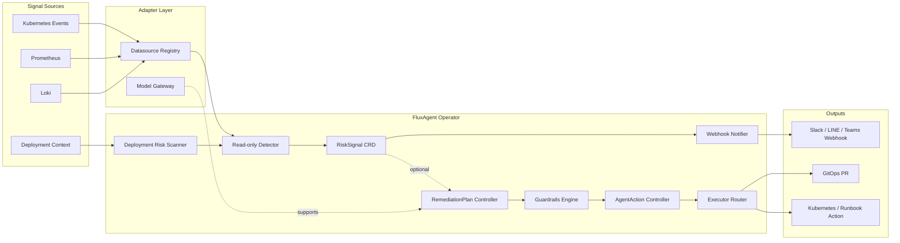

# FluxAgent

Kubernetes-native AI SRE Agent Operator for proactive risk detection, RCA assistance, and guarded remediation.

FluxAgent turns Kubernetes Events, Prometheus metrics, Loki logs, and deployment context into `RiskSignal`, `RemediationPlan`, and guarded `AgentAction` workflows.

## Why FluxAgent

- Kubernetes-native: CRD + Controller + Reconcile Loop
- Read-only first: the default `v0.1` path does not mutate production
- Provider-neutral: OpenAI, Claude, Gemini, Bedrock, Local Model
- Observability-native: Prometheus, Loki, Kubernetes Events, OpenTelemetry
- Guardrails-first: policy, dry-run, approval, and audit before execution
- GitOps-first: prefer pull requests over direct production patching

## Architecture



Read the long-form architecture in [docs/architecture/overview.md](/Users/czhuang/Chongzhe-workspace/HomeLab/FluxSeer/FluxAgent/docs/architecture/overview.md:1).

## Runtime Modes

### `v0.1` Read-only RiskSignal Operator

This is the default mode when you run `cmd/manager`.

- watches annotated `Deployment` resources
- queries Kubernetes Events
- optionally queries Prometheus and Loki when URLs are configured
- creates `RiskSignal`
- sends webhook notifications
- does not create `RemediationPlan` or `AgentAction`

### Optional Guarded Remediation

Enable this explicitly with `--enable-remediation=true`.

- `RiskSignal` can generate `RemediationPlan`
- guardrails decide auto-approve / waiting approval / reject
- approved `AgentAction` routes through executor adapters
- execution remains separated from AI reasoning

## Core CRDs

- `RiskSignal`: observed risk with evidence and confidence
- `RemediationPlan`: proposed, reviewable mitigation workflow
- `AgentAction`: guarded executable action with approval context

See:

- [config/samples/risk-signal.yaml](/Users/czhuang/Chongzhe-workspace/HomeLab/FluxSeer/FluxAgent/config/samples/risk-signal.yaml:1)
- [config/samples/remediation-plan.yaml](/Users/czhuang/Chongzhe-workspace/HomeLab/FluxSeer/FluxAgent/config/samples/remediation-plan.yaml:1)
- [config/samples/agent-action.yaml](/Users/czhuang/Chongzhe-workspace/HomeLab/FluxSeer/FluxAgent/config/samples/agent-action.yaml:1)

## Repo Layout

- `cmd/manager`: canonical controller-runtime manager entrypoint
- `internal/controllers`: Kubernetes reconcilers
- `internal/detector`: read-only signal detection logic
- `internal/datasource`: Prometheus, Loki, Kubernetes Events, and other datasource adapters
- `internal/model`: provider-neutral model gateway abstractions
- `internal/guardrails`: approval and policy checks
- `internal/executor`: execution routing
- `examples/kind`: local demo flow

## Quickstart

### Local Demo Pipeline

```bash
cd FluxAgent
GOWORK=off go run ./cmd/fluxagent
GOWORK=off go test ./...
```

### Run the Operator

```bash
cd FluxAgent
GOWORK=off go run ./cmd/manager
```

### Deploy to a Cluster

```bash
cd FluxAgent
kubectl create namespace fluxagent-system
kubectl apply -k config/default
```

## kind Demo

```bash
cd FluxAgent
make demo-up
make inject-fault
make demo-status
make demo-down
```

This demo deploys:

- FluxAgent manager
- a sample app annotated for read-only scanning
- a fake observability service that simulates Prometheus, Loki, and webhook outputs

## Current Scope

FluxAgent is already a working open-source skeleton, but it is not yet a production-grade remediation platform.

Implemented today:

- read-only `RiskSignal` generation flow
- controller-runtime manager and reconcilers
- Prometheus, Loki, and Kubernetes Events adapter implementations
- webhook notification flow
- provider-neutral model abstractions
- optional guarded remediation path
- kind demo scaffolding

Not implemented yet:

- production-hardened auth, retries, and backoff for all adapters
- real LLM provider integrations wired into runtime config
- GitOps PR backends and approval UX
- admission policies and richer multi-cluster support

## Documentation

- [docs/README.md](/Users/czhuang/Chongzhe-workspace/HomeLab/FluxSeer/FluxAgent/docs/README.md:1)
- [docs/architecture/overview.md](/Users/czhuang/Chongzhe-workspace/HomeLab/FluxSeer/FluxAgent/docs/architecture/overview.md:1)
- [docs/architecture/read-only-flow.md](/Users/czhuang/Chongzhe-workspace/HomeLab/FluxSeer/FluxAgent/docs/architecture/read-only-flow.md:1)
- [docs/architecture/remediation-flow.md](/Users/czhuang/Chongzhe-workspace/HomeLab/FluxSeer/FluxAgent/docs/architecture/remediation-flow.md:1)
- [docs/crd-reference/risksignal.md](/Users/czhuang/Chongzhe-workspace/HomeLab/FluxSeer/FluxAgent/docs/crd-reference/risksignal.md:1)
- [docs/adapters/prometheus.md](/Users/czhuang/Chongzhe-workspace/HomeLab/FluxSeer/FluxAgent/docs/adapters/prometheus.md:1)
- [docs/tutorials/quickstart-kind.md](/Users/czhuang/Chongzhe-workspace/HomeLab/FluxSeer/FluxAgent/docs/tutorials/quickstart-kind.md:1)
- [docs/github-repo.md](/Users/czhuang/Chongzhe-workspace/HomeLab/FluxSeer/FluxAgent/docs/github-repo.md:1)
- [ROADMAP.md](/Users/czhuang/Chongzhe-workspace/HomeLab/FluxSeer/FluxAgent/ROADMAP.md:1)
- [docs/open-source-positioning.md](/Users/czhuang/Chongzhe-workspace/HomeLab/FluxSeer/FluxAgent/docs/open-source-positioning.md:1)

## License

Apache-2.0. See [LICENSE](/Users/czhuang/Chongzhe-workspace/HomeLab/FluxSeer/FluxAgent/LICENSE:1).
