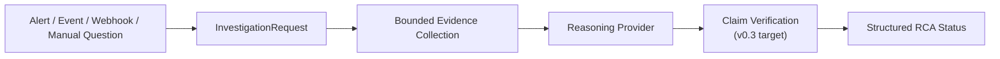
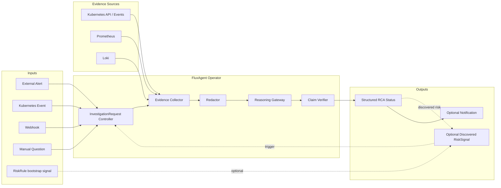

# FluxAgent

Kubernetes-native SRE RCA control plane for teams that want explicit, auditable, and security-first AI-assisted investigation.

Current release: `v0.2.0-beta.1`

Status: `v0.2 read-only RCA beta / early v0.3 RCA contract hardening`

FluxAgent turns production signals and operator questions into structured, evidence-linked RCA resources in Kubernetes.

FluxAgent exists for platform teams that need to answer:

```text
What evidence did this RCA use?
Which claims are supported, inferred, or missing evidence?
Which datasources failed or degraded?
Can this investigation be audited, reproduced from recorded query metadata, and compared later?
```

FluxAgent is the Kubernetes control plane and audit contract around RCA. It is not an all-in-one monitoring stack, not a free-form cluster agent, and not an autonomous production remediation system.

## Why FluxAgent

FluxAgent is built around four product decisions:

- Evidence-linked RCA over free-form incident prose.
- Kubernetes CRD status as the durable workflow and audit surface.
- Dependency-neutral evidence collection from existing Kubernetes, Prometheus, and Loki sources.
- Read-only default behavior with heuristic RCA available without external API calls.

This positioning is intentionally narrower than a general AI SRE agent. `RiskRule` is an optional bootstrap signal source, not an attempt to replace Alertmanager or own all Kubernetes detection. Remediation CRDs are optional extensions, not the default product path.

## Minimum Flow



The current `v0.2` release supports the operator-first RCA path:

```text
InvestigationRequest
-> Kubernetes Events / Prometheus / Loki evidence
-> heuristic, OpenAI, Claude, or Gemini RCA
-> structured status with compact evidence references
```

The `v0.3` direction is to harden claim verification into a stricter RCA contract:

```text
Claim
-> Evidence reference
-> Verification status
```

## Example RCA Status

The v0.3 target status contract makes important RCA claims machine-checkable instead of returning only Markdown prose:

```yaml
status:
  phase: Completed
  verdict:
    summary: "checkout is failing because it is configured for the wrong Redis port."
    rootCauseEntity:
      apiVersion: apps/v1
      kind: Deployment
      namespace: prod
      name: checkout
    rootCauseType: ConfigurationMismatch
    confidence: 0.91
  claims:
    - id: claim-001
      statement: "checkout connects to Redis on port 6379."
      evidenceRefs:
        - evidence-001
      verification: Supported
    - id: claim-002
      statement: "redis Service exposes port 6380."
      evidenceRefs:
        - evidence-002
      verification: Supported
  alternativeHypotheses:
    - statement: "Redis is unavailable."
      disposition: Rejected
      evidenceRefs:
        - evidence-003
  missingEvidence:
    - source: traces
      reason: DataSourceNotConfigured
  degradation:
    partial: true
    unavailableSources:
      - loki-secondary
  execution:
    provider: heuristic-provider
    attempts: 1
    durationSeconds: 4
```

The current status implements the first structured RCA contract: `verdict`, `claims`, evidence IDs, `degradation`, and `execution` metadata are persisted alongside the compatibility `summary`, `hypothesis`, and `confidence` fields. Deeper claim verification, alternative hypothesis ranking, and richer partial-failure semantics remain `v0.3` hardening work.

## Security Posture

FluxAgent is security-first by default:

- runs read-only unless guarded remediation is explicitly enabled
- uses heuristic RCA without external model calls by default
- requires explicit `ModelProvider` and provider credentials before sending evidence to OpenAI, Claude, or Gemini
- redacts provider-bound evidence before hosted API calls
- does not persist raw observability payloads, model prompts, provider responses, Kubernetes Secret values, tokens, or authorization headers
- does not package CLI agent runtimes, developer-local OAuth caches, or subscription sessions as cluster credentials
- does not automatically inspect every namespace; scope is declared through `RiskRule`, `DataSource`, and `InvestigationRequest`

This trades some first-run convenience for lower default resource usage, stronger auditability, and clearer control over what data can leave the cluster.

## Architecture

Target RCA architecture:



Current `v0.2` implements bounded evidence collection, provider reasoning, status conditions, compact evidence references, and the first structured RCA status fields. Evidence-linked claim verification is the `v0.3` hardening target.

Read the long-form architecture in [docs/architecture/overview.md](/Users/czhuang/Chongzhe-workspace/HomeLab/FluxSeer/FluxAgent/docs/architecture/overview.md:1).

## Runtime Modes

### Read-only RCA Control Plane

This is the default mode when you run the operator.

- accepts `InvestigationRequest` objects for ad-hoc or externally triggered RCA
- collects bounded evidence from declared datasources
- redacts evidence before hosted provider calls
- stores RCA output in CRD status
- may emit a newly discovered `RiskSignal` from optional bootstrap rules or investigation findings
- does not create `RemediationPlan` or `AgentAction` unless guarded remediation is explicitly enabled

## Dependency Matrix

FluxAgent distinguishes runtime, compile-time, and deployment dependency.

| Integration | Runtime | Compile-time | Deployment | Current Role |
| --- | --- | --- | --- | --- |
| Kubernetes | required for operator mode | yes in controllers and CRD API | installed by FluxAgent manifests | control plane and default event source |
| Kubernetes Events | enabled by default | yes via Kubernetes adapter | no extra stack required | default datasource |
| Prometheus | optional | isolated to adapter packages | not installed by default | metrics datasource |
| Loki | optional | isolated to adapter packages | not installed by default | logs datasource |
| External model APIs | optional | isolated to model-provider packages | not installed by default | RCA enrichment |
| Remediation executors | optional | isolated to executor packages | disabled by default | guarded expansion path |

The longer-form design constraints are documented in [docs/architecture/dependency-neutrality.md](/Users/czhuang/Chongzhe-workspace/HomeLab/FluxSeer/FluxAgent/docs/architecture/dependency-neutrality.md:1).

## Baseline Rule Packs

FluxAgent includes an optional Kubernetes baseline rule pack for first-run bootstrap. It helps a new install surface common workload failure events without requiring users to write their first `RiskRule` by hand, but it is not intended to replace Alertmanager or a production detection platform.

The default chart enables only the Kubernetes Events baseline for Deployments in the release namespace. Prometheus and Loki baselines are opt-in and require user-provided `DataSource` resources. See [docs/helm-rulepacks.md](/Users/czhuang/Chongzhe-workspace/HomeLab/FluxSeer/FluxAgent/docs/helm-rulepacks.md:1) for values, rule lists, override examples, and verification commands.

## Optional Extensions

### Bootstrap Rule Packs

`RiskRule` and built-in rule packs are optional signal sources. They help a new install produce value without requiring every first rule to be written by hand, but they are not meant to replace a monitoring platform or Alertmanager.

### Guarded Remediation

Enable this explicitly with `--enable-remediation=true`.

- `RiskSignal` can generate `RemediationPlan`
- guardrails decide auto-approve / waiting approval / reject
- approved `AgentAction` routes through executor adapters
- execution remains separated from AI reasoning

## Core CRDs

- `RiskRule`: read-only detection rule definition
- `InvestigationRequest`: ad-hoc investigation request with structured RCA status and optional discovered `RiskSignal`
- `DataSource`: optional datasource runtime configuration
- `ModelProvider`: provider-neutral reasoning backend configuration
- `RiskSignal`: observed risk with evidence and confidence
- `RemediationPlan`: experimental proposed mitigation workflow
- `AgentAction`: experimental guarded executable action with approval context

`ModelProvider` is the current `v1alpha1` API name for reasoning backends, including the built-in heuristic path. `v0.3` will review whether this should become `ReasoningProvider` before a breaking API cut.

See:

- [config/samples/risk-rule.yaml](/Users/czhuang/Chongzhe-workspace/HomeLab/FluxSeer/FluxAgent/config/samples/risk-rule.yaml:1)
- [config/samples/investigation-request.yaml](/Users/czhuang/Chongzhe-workspace/HomeLab/FluxSeer/FluxAgent/config/samples/investigation-request.yaml:1)
- [config/samples/investigation-queries.yaml](/Users/czhuang/Chongzhe-workspace/HomeLab/FluxSeer/FluxAgent/config/samples/investigation-queries.yaml:1)
- [config/samples/datasource-prometheus.yaml](/Users/czhuang/Chongzhe-workspace/HomeLab/FluxSeer/FluxAgent/config/samples/datasource-prometheus.yaml:1)
- [config/samples/datasource-loki.yaml](/Users/czhuang/Chongzhe-workspace/HomeLab/FluxSeer/FluxAgent/config/samples/datasource-loki.yaml:1)
- [config/samples/datasource-kubernetes-events.yaml](/Users/czhuang/Chongzhe-workspace/HomeLab/FluxSeer/FluxAgent/config/samples/datasource-kubernetes-events.yaml:1)
- [config/samples/model-provider.yaml](/Users/czhuang/Chongzhe-workspace/HomeLab/FluxSeer/FluxAgent/config/samples/model-provider.yaml:1)
- [config/samples/model-provider-openai.yaml](/Users/czhuang/Chongzhe-workspace/HomeLab/FluxSeer/FluxAgent/config/samples/model-provider-openai.yaml:1)
- [config/samples/model-provider-gemini.yaml](/Users/czhuang/Chongzhe-workspace/HomeLab/FluxSeer/FluxAgent/config/samples/model-provider-gemini.yaml:1)
- [config/samples/model-provider-claude.yaml](/Users/czhuang/Chongzhe-workspace/HomeLab/FluxSeer/FluxAgent/config/samples/model-provider-claude.yaml:1)
- [config/samples/model-provider-openai-secret.yaml](/Users/czhuang/Chongzhe-workspace/HomeLab/FluxSeer/FluxAgent/config/samples/model-provider-openai-secret.yaml:1)
- [config/samples/model-provider-gemini-secret.yaml](/Users/czhuang/Chongzhe-workspace/HomeLab/FluxSeer/FluxAgent/config/samples/model-provider-gemini-secret.yaml:1)
- [config/samples/model-provider-claude-secret.yaml](/Users/czhuang/Chongzhe-workspace/HomeLab/FluxSeer/FluxAgent/config/samples/model-provider-claude-secret.yaml:1)
- [config/samples/risk-signal.yaml](/Users/czhuang/Chongzhe-workspace/HomeLab/FluxSeer/FluxAgent/config/samples/risk-signal.yaml:1)
- [config/samples/remediation-plan.yaml](/Users/czhuang/Chongzhe-workspace/HomeLab/FluxSeer/FluxAgent/config/samples/remediation-plan.yaml:1)
- [config/samples/agent-action.yaml](/Users/czhuang/Chongzhe-workspace/HomeLab/FluxSeer/FluxAgent/config/samples/agent-action.yaml:1)

## Repo Layout

- `cmd/manager`: canonical controller-runtime manager entrypoint
- `internal/controllers`: Kubernetes reconcilers
- `internal/detector`: read-only signal detection logic
- `internal/datasource`: Prometheus, Loki, Kubernetes Events, and other datasource adapters
- `internal/datasourceconfig`: `DataSource` resource loading and adapter construction
- `internal/model`: provider-neutral model gateway abstractions
- `internal/guardrails`: approval and policy checks
- `internal/executor`: execution routing
- `examples/kind`: local demo flow

## Quickstart

### Install The Beta Chart

```bash
helm install fluxagent \
  oci://test-harbor.fluxseer.com/fluxseer/fluxagent/charts/kube-ai-sre \
  --version 0.2.0-beta.1 \
  --namespace fluxagent-system \
  --create-namespace

kubectl -n fluxagent-system rollout status deployment/fluxagent-controller-manager
```

### Run A Read-only Investigation

Create a Kubernetes Events datasource and a first investigation. Leaving `modelProviderRef` empty uses the built-in heuristic provider, so this path does not require OpenAI, Claude, or Gemini credentials:

```bash
kubectl apply -f - <<'EOF'
apiVersion: aiops.platform/v1alpha1
kind: DataSource
metadata:
  name: kubernetes-events
  namespace: fluxagent-system
spec:
  type: kubernetesEvents
---
apiVersion: aiops.platform/v1alpha1
kind: InvestigationRequest
metadata:
  name: investigate-fluxagent
  namespace: fluxagent-system
spec:
  target:
    namespace: fluxagent-system
    kind: Deployment
    name: fluxagent-controller-manager
    apiVersion: apps/v1
  timeRange:
    lookback: 15m
  question: |
    Is the FluxAgent controller healthy after install?
  dataSources:
    - name: kubernetes-events
  mode: readOnly
EOF

kubectl -n fluxagent-system wait investigationrequest/investigate-fluxagent \
  --for=condition=Ready \
  --timeout=120s

kubectl -n fluxagent-system get investigationrequest investigate-fluxagent -o yaml
```

This writes an `InvestigationRequest`, collects bounded Kubernetes evidence, and stores the RCA in `status.verdict`, `status.claims`, `status.evidenceRefs`, and compatibility summary fields.

See:

- [docs/tutorials/investigate-workload.md](/Users/czhuang/Chongzhe-workspace/HomeLab/FluxSeer/FluxAgent/docs/tutorials/investigate-workload.md:1)
- [docs/crd-reference/investigationrequest.md](/Users/czhuang/Chongzhe-workspace/HomeLab/FluxSeer/FluxAgent/docs/crd-reference/investigationrequest.md:1)

### Development

```bash
cd FluxAgent
GOWORK=off go test ./...
make verify-v0.2-beta
```

### Enable Hosted RCA Providers

Hosted OpenAI, Gemini, and Claude provider usage is documented in:

- [docs/tutorials/enable-hosted-model-providers.md](/Users/czhuang/Chongzhe-workspace/HomeLab/FluxSeer/FluxAgent/docs/tutorials/enable-hosted-model-providers.md:1)

## kind Demo

```bash
cd FluxAgent
make demo-up
make inject-fault
make demo-status
make demo-degrade-missing-datasource
make demo-degrade-capability-mismatch
make demo-degrade-provider-auth-failed
make demo-degrade-all
make demo-reset-riskrule
make verify-e2e-kind
make verify-investigation-kind
make demo-down
```

For recording, you can extend the pause between `demo-degrade-all` sections:

```bash
make demo-degrade-all DEMO_PAUSE_SECONDS=6
```

This demo deploys:

- FluxAgent manager
- a sample app selected by `RiskRule`
- a sample heuristic `ModelProvider`
- `DataSource` resources for Prometheus, Loki, and Kubernetes Events
- a fake observability service that simulates Prometheus, Loki, and webhook outputs

The demo uses fake observability on purpose. FluxAgent does not require installing Prometheus or Loki just to validate the read-only path.

`make demo-status` now shows the core condition surfaces for:

- `DataSource`
- `RiskRule`
- `RiskSignal`

The demo also includes degraded-case helpers so you can intentionally trigger:

- `DataSourceNotFound`
- `CapabilityMismatch`

For a full end-to-end validation of the kind flow, run:

```bash
make verify-e2e-kind
```

`verify-e2e-kind` is part of the `v0.2` beta validation set. It covers both:

- the read-only `RiskRule -> RiskSignal` path
- the operator-first `InvestigationRequest -> structured RCA status` path with optional discovered-signal materialization

For the operator-first investigation path, run:

```bash
make verify-investigation-kind
```

This target will:

- create the demo cluster
- wait for manager and demo workloads to become ready
- inject a fault
- create an `InvestigationRequest`
- wait for terminal RCA status
- assert that evidence references and RCA summary fields are populated
- assert optional discovered `RiskSignal` materialization remains functional
- assert degraded investigation conditions for missing datasource and capability mismatch
- clean up the kind cluster automatically

## Current Scope

FluxAgent is already a working open-source project, but it is not yet a production-grade remediation platform.

Implemented today:

- read-only `RiskSignal` generation flow
- `InvestigationRequest` ad-hoc RCA flow with configurable `queries[]`
- optional discovered `RiskSignal` materialization from an `InvestigationRequest`
- controller-runtime manager and reconcilers
- Prometheus, Loki, and Kubernetes Events adapter implementations
- webhook notification flow
- provider-neutral model abstractions
- heuristic model-provider runtime path
- hosted OpenAI, Gemini, and Claude model-provider runtime adapters
- optional guarded remediation path
- kind demo scaffolding

RCA contract gaps:

- stricter evidence-linked claim verification
- alternative hypothesis disposition beyond the initial field shape
- richer evidence provenance with query digests, redaction flags, truncation flags, and content digests
- replay modes that distinguish metadata replay, re-query replay, and snapshot replay
- RCA evaluation harness for provider and heuristic regressions
- bounded adaptive investigation beyond static datasource plans
- explicit abstention outcomes such as `Inconclusive` or `InsufficientEvidence`

Operational gaps:

- production-hardened auth, retries, and backoff for all adapters
- production-hardened vendor auth, retry, and response-governance coverage
- GitOps PR backends and approval UX
- admission policies and richer multi-cluster support

## Documentation

- [docs/README.md](/Users/czhuang/Chongzhe-workspace/HomeLab/FluxSeer/FluxAgent/docs/README.md:1)
- [docs/architecture/overview.md](/Users/czhuang/Chongzhe-workspace/HomeLab/FluxSeer/FluxAgent/docs/architecture/overview.md:1)
- [docs/architecture/dependency-neutrality.md](/Users/czhuang/Chongzhe-workspace/HomeLab/FluxSeer/FluxAgent/docs/architecture/dependency-neutrality.md:1)
- [docs/architecture/read-only-flow.md](/Users/czhuang/Chongzhe-workspace/HomeLab/FluxSeer/FluxAgent/docs/architecture/read-only-flow.md:1)
- [docs/architecture/remediation-flow.md](/Users/czhuang/Chongzhe-workspace/HomeLab/FluxSeer/FluxAgent/docs/architecture/remediation-flow.md:1)
- [docs/crd-reference/risksignal.md](/Users/czhuang/Chongzhe-workspace/HomeLab/FluxSeer/FluxAgent/docs/crd-reference/risksignal.md:1)
- [docs/crd-reference/datasource.md](/Users/czhuang/Chongzhe-workspace/HomeLab/FluxSeer/FluxAgent/docs/crd-reference/datasource.md:1)
- [docs/adapters/prometheus.md](/Users/czhuang/Chongzhe-workspace/HomeLab/FluxSeer/FluxAgent/docs/adapters/prometheus.md:1)
- [docs/tutorials/quickstart-kind.md](/Users/czhuang/Chongzhe-workspace/HomeLab/FluxSeer/FluxAgent/docs/tutorials/quickstart-kind.md:1)
- [docs/github-repo.md](/Users/czhuang/Chongzhe-workspace/HomeLab/FluxSeer/FluxAgent/docs/github-repo.md:1)
- [ROADMAP.md](/Users/czhuang/Chongzhe-workspace/HomeLab/FluxSeer/FluxAgent/ROADMAP.md:1)
- [docs/open-source-positioning.md](/Users/czhuang/Chongzhe-workspace/HomeLab/FluxSeer/FluxAgent/docs/open-source-positioning.md:1)

## License

Apache-2.0. See [LICENSE](/Users/czhuang/Chongzhe-workspace/HomeLab/FluxSeer/FluxAgent/LICENSE:1).
