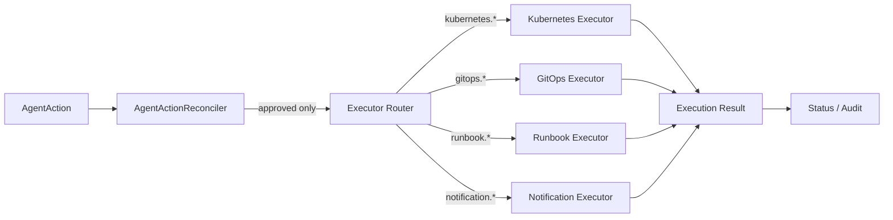

# Action Executor

FluxSeer RCA separates decision-making from execution. The executor layer only runs actions that have already passed policy and approval.

## Router Contract

Source: [internal/executor/router.go](../../internal/executor/router.go)

The target v0.5 contract and lifecycle are defined in the
[Executor safety contract](executor-safety-contract.md). Batch 1 now exposes
the typed `ExecutorRequest` and `ExecutorResult` contract; identity
generation, idempotency enforcement, lifecycle recovery, and real side
effects remain alpha.1 work. The bundled backends are still simulation
oriented.

The router dispatches by action prefix:

- `kubernetes.*`
- `gitops.*`
- `runbook.*`
- `notification.*`

This keeps the `AgentAction` CRD stable while allowing multiple execution backends.

## Execution Role

The executor layer is the side-effect boundary of the system.

The intended handoff is:

```text
AgentAction
→ AgentActionReconciler
→ Executor Router
→ Backend-specific Executor
→ Execution Result
→ Status / Audit
```

This means controllers and model providers do not need to know how a Kubernetes action, GitOps change, runbook trigger, or notification is actually performed.

## Current Executors

### Kubernetes Executor

- simulates rollout pause, scale, or other Kubernetes-style actions
- returns execution metadata instead of mutating a live workload

### GitOps Executor

- simulates a pull request style change
- returns branch and action metadata

### Runbook Executor

- simulates workflow or SOP execution
- returns workflow metadata

### Notification Executor

- can send a real webhook when `FLUXSEER_RCA_WEBHOOK_URL` is configured
- source: [internal/executor/notification.go](../../internal/executor/notification.go)

## Architecture Diagram



## Why This Layer Exists

Without a dedicated executor layer, the controller or model logic would need to know:

- how to perform a GitOps change
- how to call a runbook system
- how to notify chat systems
- how to persist execution results

That would couple reasoning, policy, and side effects together. FluxSeer RCA avoids that.

## Execution Contract Expectations

Live executors should eventually support:

- dry-run semantics where possible
- idempotent behavior for retry safety
- timeout and retry policy
- structured execution result status
- rollback hints
- audit-friendly metadata

## Current Production Posture

The executors expose the right interfaces, but only notification has a real outbound path in the current repo. Kubernetes, GitOps, and runbook execution are still simulation-oriented.

That remains the current `v0.4.0-beta.3` posture: the project leads with safe
contracts, auditable approval flow, and local demoability. The next milestone
is v0.5 **Safe Remediation**, which will productionize only the allowlisted
Kubernetes and GitOps paths and add post-action effectiveness verification;
Runbook execution and broad autonomous mutation remain deferred.
