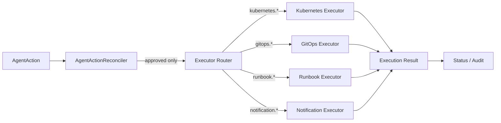

# Action Executor

FluxSeer RCA separates decision-making from execution. The executor layer only runs actions that have already passed policy and approval.

## Router Contract

Source: [internal/executor/router.go](../../internal/executor/router.go)

The target v0.5 contract and lifecycle are defined in the
[Executor safety contract](executor-safety-contract.md). Batch 1 now exposes
the typed `ExecutorRequest` and `ExecutorResult` contract, deterministic
identity generation, idempotency enforcement, lifecycle recovery, and one
gated real Kubernetes side-effect path. The bundled GitOps, Runbook, and
non-allowlisted Kubernetes routes remain simulation-oriented.

The router dispatches by action prefix:

- `kubernetes.*`
- `gitops.*`
- `runbook.*`
- `notification.*`

This keeps the `AgentAction` CRD stable while allowing multiple execution backends.

## Execution Role

The executor layer is the side-effect boundary of the system.

The intended handoff is:

```text
AgentAction
→ AgentActionReconciler
→ Executor Router
→ Backend-specific Executor
→ Execution Result
→ Status / Audit
```

This means controllers and model providers do not need to know how a Kubernetes action, GitOps change, runbook trigger, or notification is actually performed.

## Current Executors

### Kubernetes Executor

- simulates unsupported or non-alpha Kubernetes-style actions by default
- executes only the allowlisted `kubernetes.rolloutRestart` Deployment path
  when `--enable-experimental-executor=true` and the matching RBAC profile are
  enabled
- validates target UID and records the execution identity on the Pod template
- resolves uncertain results through read-after-write lookup
- captures an immutable pre-action Deployment health baseline
- creates a settling-window, read-only verification investigation and evaluates
  the post-action result as `Effective`, `Ineffective`, `Regressed`, or
  `Inconclusive`

### GitOps Executor

- simulates a pull request style change
- returns branch and action metadata

### Runbook Executor

- simulates workflow or SOP execution
- returns workflow metadata

### Notification Executor

- can send a real webhook when `FLUXSEER_RCA_WEBHOOK_URL` is configured
- source: [internal/executor/notification.go](../../internal/executor/notification.go)

## Architecture Diagram



## Why This Layer Exists

Without a dedicated executor layer, the controller or model logic would need to know:

- how to perform a GitOps change
- how to call a runbook system
- how to notify chat systems
- how to persist execution results

That would couple reasoning, policy, and side effects together. FluxSeer RCA avoids that.

## Execution Contract Expectations

Live executors should eventually support:

- dry-run semantics where possible
- idempotent behavior for retry safety
- timeout and retry policy
- structured execution result status
- rollback hints
- audit-friendly metadata

## Current Production Posture

The executors expose the shared contract. Notification has a real outbound
path, and Kubernetes now has one explicitly gated `rolloutRestart` path;
GitOps, Runbook, and all other Kubernetes actions remain simulation-oriented.

That remains the current `v0.4.0-beta.3` release posture, while this branch
contains the bounded v0.5-alpha.1 Safe Remediation slice: one allowlisted
Kubernetes action with post-action verification. GitOps production execution,
Runbook execution, and broad autonomous mutation remain deferred.
