# FluxAgent Mermaid Architecture Diagrams

This document is the maintained Mermaid diagram set for the current `v0.3` FluxAgent architecture.

Scope:

- current default path: read-only RCA through `RiskRule` and `InvestigationRequest`
- current optional integrations: Prometheus, Loki, Kubernetes Events, OpenAI API, Claude API, Gemini API, heuristic provider
- current guarded experimental path: `RemediationPlan` and `AgentAction`
- current release identity: `v0.3.0-beta.2`
- API group/version identity: `aiops.platform/v1alpha1`

The API group and version identity are fixed for the current `v0.3` line. The `v1alpha1` schema remains subject to compatible beta hardening.

The diagrams are intentionally Kubernetes-native. Hosted providers receive bounded evidence bundles; they do not receive cluster credentials or direct Kubernetes API access.

Important `v0.3.0-beta.2` boundary: direct `RiskRule` RCA receives gateway-level hosted-provider egress opt-in enforcement, but the canonical `InvestigationRequest` path remains the only path with full `status.execution.egressAudit` visibility.

## System Context

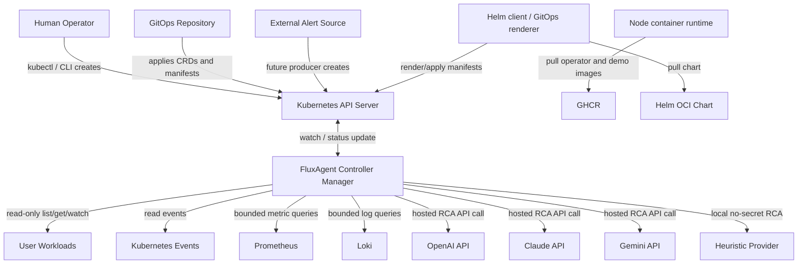

## Runtime Layers

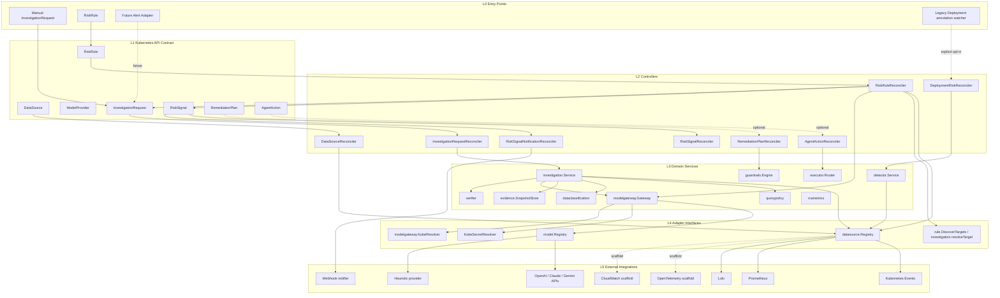

## Kubernetes CRD Relationship

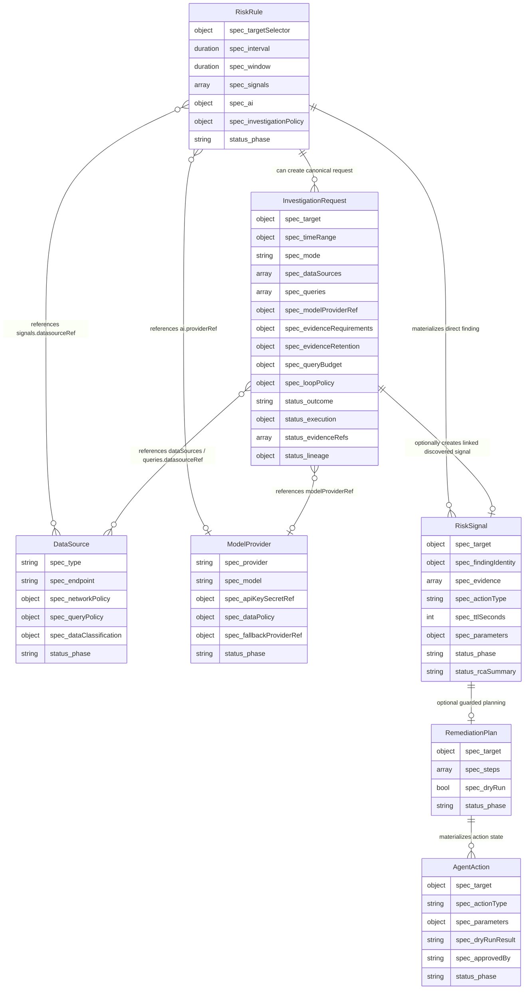

## API Class Diagram

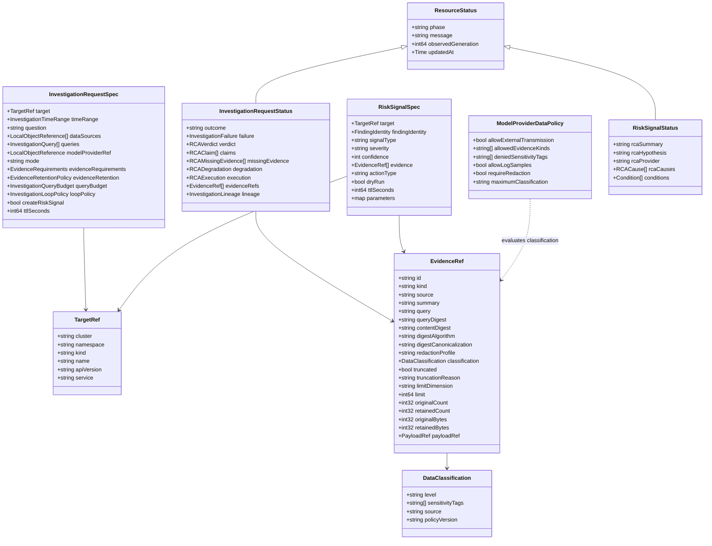

## Controller Ownership

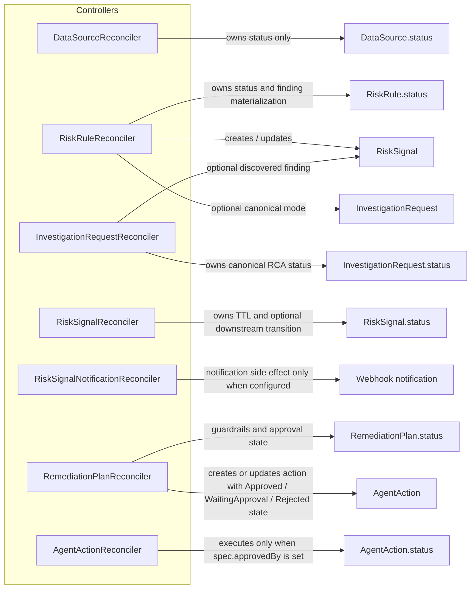

## Read-only RiskRule Flow

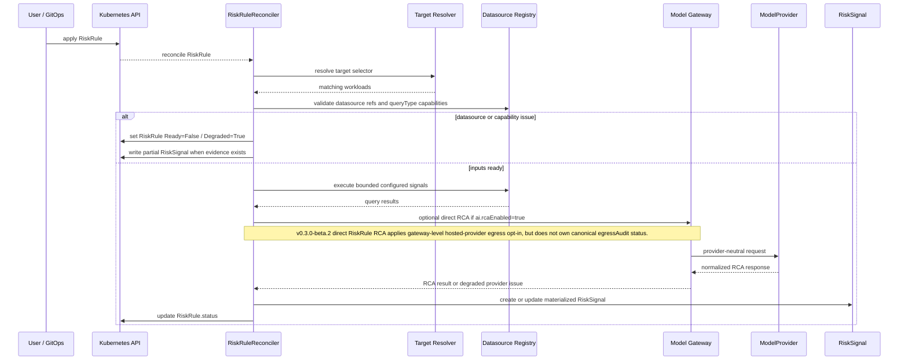

## Canonical InvestigationRequest Flow

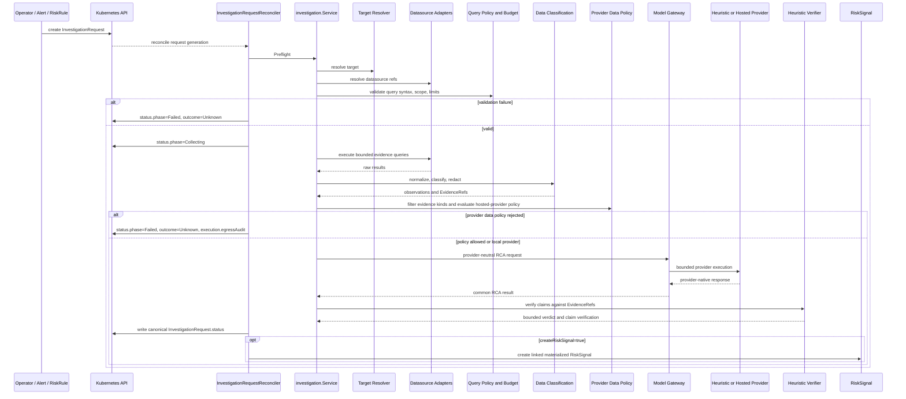

## Evidence And Classification Pipeline

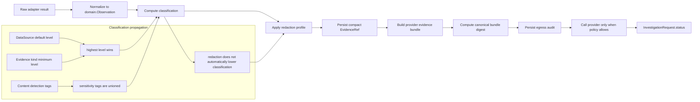

## Hosted Provider Egress Decision

This diagram describes the canonical `InvestigationRequest` path in `v0.3.0-beta.2`.

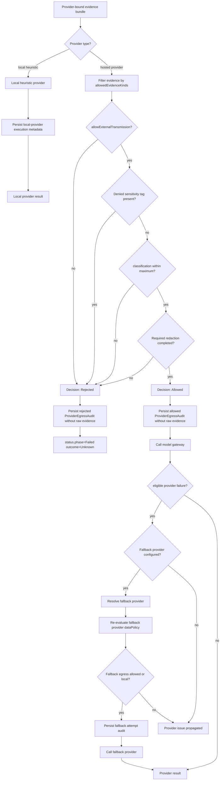

## Provider Adapter Conformance

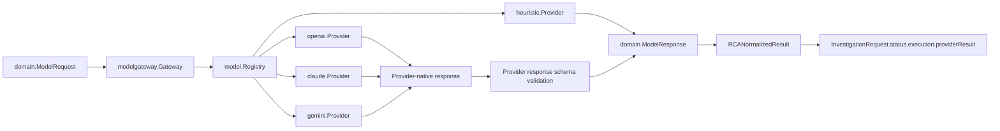

## Idempotent RCA Execution

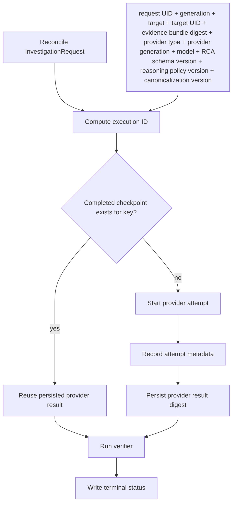

## Evidence Retention Boundary

`EvidenceRef.query` may be persisted in `InvestigationRequest.status`; users should not place secret-bearing text in query strings. The beta.2 retention boundary avoids storing full raw adapter payloads, large raw logs, and provider prompts in status.

The `local-filesystem` normalized snapshot store is development-oriented in `v0.3.0-beta.2`: it is not encrypted, has no automatic snapshot garbage collection, and should not be treated as durable production evidence storage.

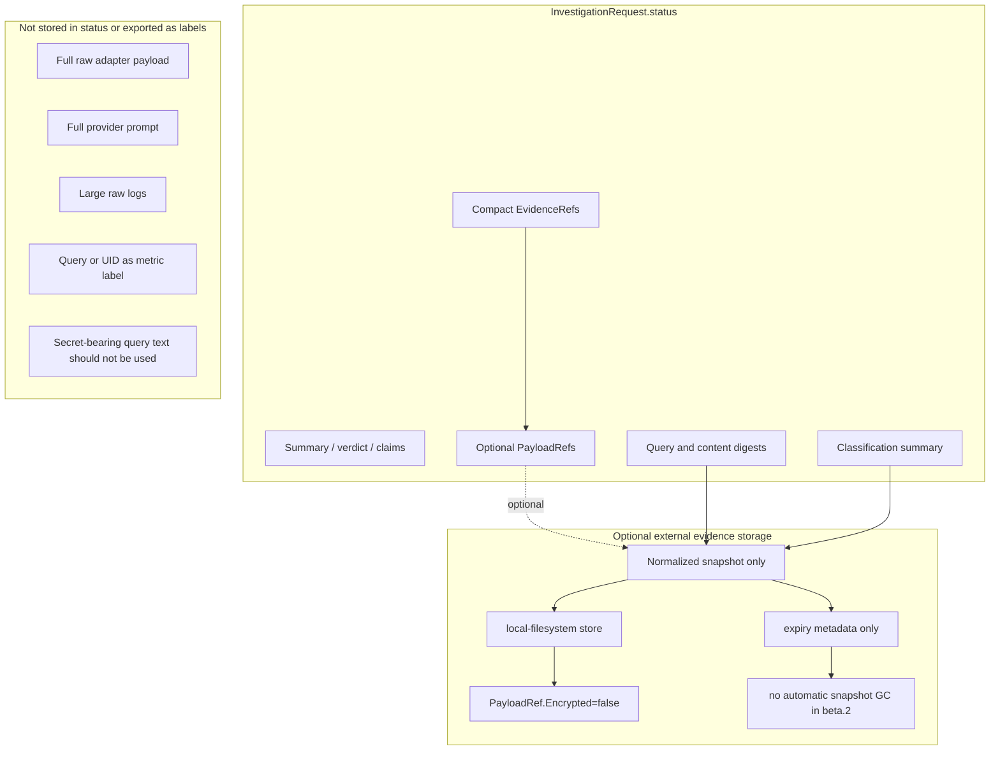

## Query Policy And Budget

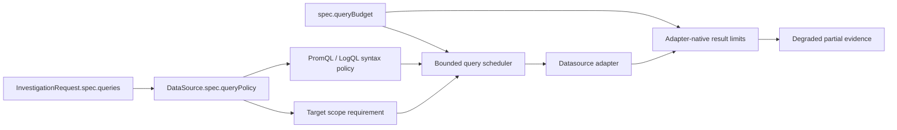

## Finding Identity And Lineage

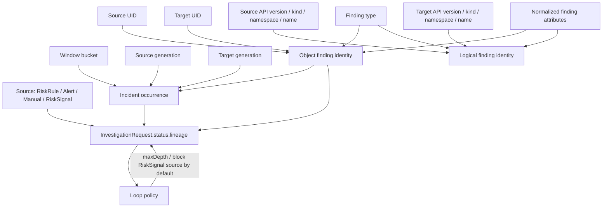

## Optional Remediation Flow

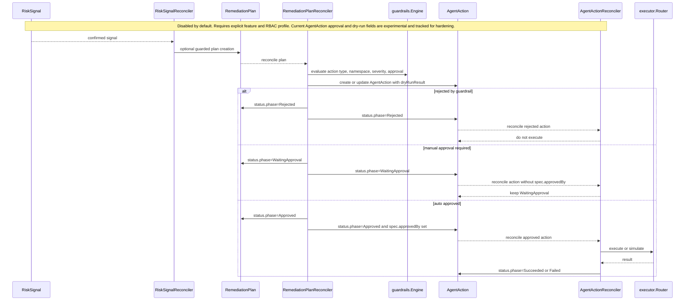

## Helm Deployment And RBAC Profiles

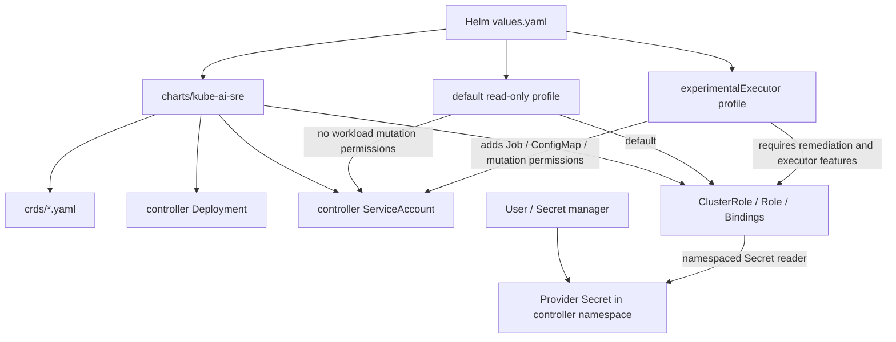

## Release And Publication Pipeline

This diagram records the `v0.3.0-beta.2` release path used by the project. The `release.yml` workflow is triggered by the annotated tag; the `test -> main -> tag` path is release discipline, not a hard workflow dependency.

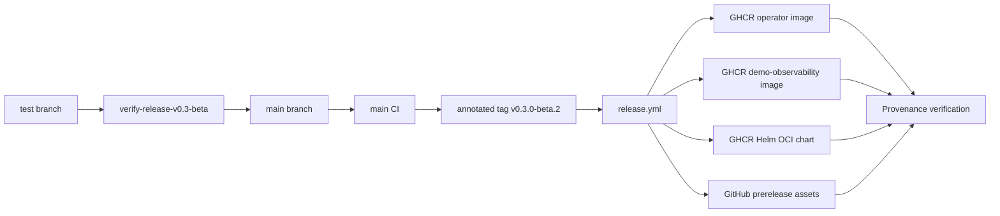

## Component To Package Map

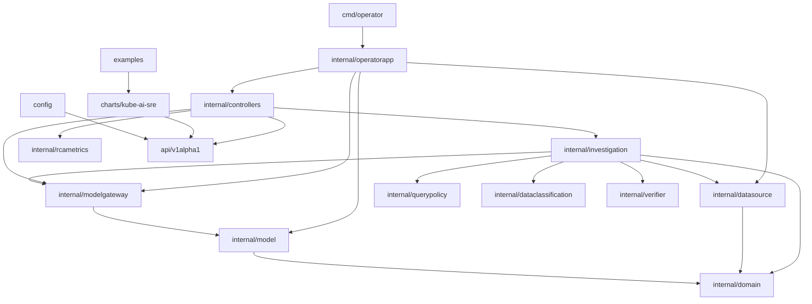
