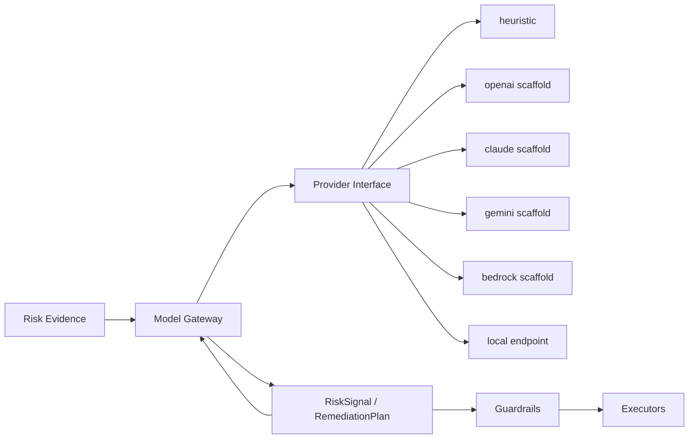

# Model Gateway

FluxAgent keeps model providers behind a provider-neutral interface so the control plane does not depend on one vendor.

## Provider Contract

Source: [internal/model/interface.go](/Users/czhuang/Chongzhe-workspace/HomeLab/FluxSeer/FluxAgent/internal/model/interface.go:1)

```go
type Provider interface {
    Name() string
    Complete(ctx context.Context, req domain.ModelRequest) (domain.ModelResponse, error)
}
```

## Current Providers

Implemented provider packages:

- `heuristic`
- `openai`
- `claude`
- `gemini`
- `bedrock`
- `local`

See [internal/model](/Users/czhuang/Chongzhe-workspace/HomeLab/FluxSeer/FluxAgent/internal/model:1).

## Architectural Role

The model gateway is a reasoning seam inside the broader remediation architecture, not the owner of workflow state or execution rights.

Its intended role is:

```text
Risk evidence
→ provider-neutral reasoning interface
→ explainable model output
→ RemediationPlan enrichment or proposal formatting
```

Its non-role is equally important:

- it does not write to Kubernetes
- it does not decide approval policy
- it does not dispatch executors
- it does not bypass CRD status transitions
- it does not check out repositories or run shell commands
- it does not host long-running agent loops

## Runtime Posture

Today the runnable path defaults to the heuristic provider. That choice is deliberate:

- no external secrets required
- no vendor lock-in in the core operator
- repeatable local demos
- safer open-source first-run story

The heuristic provider remains the default runnable path. The local HTTP endpoint is the simplest non-heuristic runtime path, and hosted `openai`, `claude`, and `gemini` adapters are also wired through `ModelProvider`.

## Architecture Diagram



## Intended Usage

The model gateway is the seam for:

- RCA drafting
- symptom correlation
- runbook selection
- remediation proposal formatting
- evidence-linked reasoning with redacted provider context

The provider should not directly own:

- Kubernetes writes
- approval decisions
- policy enforcement
- execution routing
- repository checkout
- tool execution
- pull-request creation

Those responsibilities stay in CRD controllers, guardrails, and executors.

## Agent Runtime Boundary

Codex SDK, Codex CLI, Claude Agent SDK, and Claude Code can be deployed in runners, VMs, Kubernetes Jobs, or pods. When they perform multi-turn tool use, repository inspection, command execution, test execution, or patch proposal, they are agent runtimes rather than model providers.

FluxAgent should model those runtimes behind a separate future executor contract:

```go
type InvestigationExecutor interface {
    Execute(ctx context.Context, request InvestigationRequest) (*InvestigationResult, error)
}
```

The model gateway remains for bounded reasoning:

```text
EvidenceBundle
-> ModelProvider
-> structured RCA output
```

Agent runtime credentials must be workload-scoped and revocable. Do not package developer-local ChatGPT sessions, Codex Remote sessions, OAuth caches, or interactive CLI auth files as Kubernetes secrets.

At minimum, runtime identities should be separated by role:

- `fluxagent-controller`: manages FluxAgent CRDs and bounded worker jobs, but does not read provider secret contents or mutate business workloads
- `fluxagent-investigator`: reads approved namespaces, logs, events, and metrics, but does not modify workloads or push to Git
- `fluxagent-remediator`: operates on repositories and pull requests, but does not directly write to production clusters

Production Kubernetes write access, Git repository write access, and autonomous LLM execution must not be combined in the same pod identity.

## Design Rules

- Provider output must be explainable and attachable to evidence.
- Guardrails must evaluate actions after reasoning, not inside the provider.
- Runtime should stay functional when no remote model is configured.
- Provider integrations should be swappable without CRD schema changes.
- Agent runtimes should use executor contracts, not `ModelProvider`, when they run tools or inspect repositories.
- Paid model or agent execution must be idempotent across controller restarts and leader transitions.

## Implementation Status

Implemented today:

- provider interface
- provider registry
- heuristic provider for runnable local behavior
- local endpoint provider wired into runtime configuration
- provider-bound evidence redaction before reasoning calls
- hosted `openai`, `claude`, and `gemini` adapters
- `fallbackProviderRef` failover between `ModelProvider` objects for provider and secret related failures
- shared hosted-provider timeout, HTTP status mapping, and transient retry policy

Scaffolded today:

- `bedrock`
- opt-in `AgentExecutor` CLI job lifecycle for Codex, Claude, and Gemini style runtimes

This is why the model gateway should be described as an extensibility seam with a runnable heuristic default and guarded hosted-provider support, not as a fully integrated multi-provider production inference layer.
