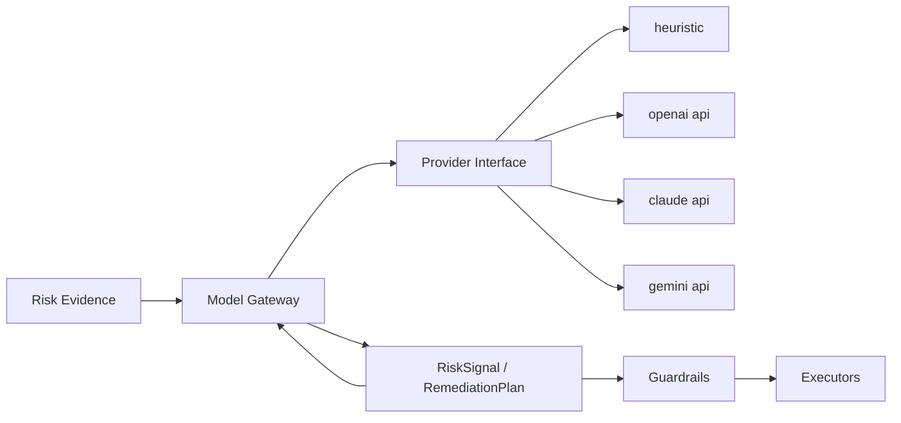

# Model Gateway

FluxSeer RCA keeps model providers behind a provider-neutral interface so the control plane does not depend on one vendor.

## Provider Contract

Source: [internal/model/interface.go](../../internal/model/interface.go)

```go
type Provider interface {
    Name() string
    Complete(ctx context.Context, req domain.ModelRequest) (domain.ModelResponse, error)
}
```

## Current Providers

Implemented provider packages:

- `heuristic`
- `openai`
- `claude`
- `gemini`

See [internal/model](../../internal/model).

## Architectural Role

The model gateway is a reasoning seam inside the broader remediation architecture, not the owner of workflow state or execution rights.

Its intended role is:

```text
Bounded EvidenceBundle
→ provider-neutral reasoning interface
→ provider-neutral structured RCA
→ claim verification
→ CRD status
```

Its non-role is equally important:

- it does not write to Kubernetes
- it does not decide approval policy
- it does not dispatch executors
- it does not bypass CRD status transitions
- it does not check out repositories or run shell commands
- it does not host long-running agent loops

## Runtime Posture

Today the runnable path defaults to the heuristic provider. That choice is deliberate:

- no external secrets required
- no vendor lock-in in the core operator
- repeatable local demos
- safer open-source first-run story

The heuristic provider remains the default runnable path. Hosted `openai`, `claude`, and `gemini` adapters are the supported external API paths through `ModelProvider`.

## Architecture Diagram



## Intended Usage

The model gateway is the seam for:

- RCA drafting
- symptom correlation
- runbook selection
- remediation proposal formatting
- evidence-linked reasoning with redacted provider context

The provider should not directly own:

- Kubernetes writes
- approval decisions
- policy enforcement
- execution routing
- repository checkout
- tool execution
- pull-request creation

Those responsibilities stay in CRD controllers, guardrails, and executors.

## Execution Boundary

The model gateway remains for bounded reasoning:

```text
EvidenceBundle
-> ModelProvider
-> structured RCA output
```

FluxSeer RCA does not package CLI agent runtimes or developer-local interactive auth caches as a supported path. Hosted providers must use workload-scoped API credentials referenced by `ModelProvider`.

## Provider-neutral Structured RCA

Provider implementations may differ in reasoning quality, but they must normalize to one FluxSeer RCA-owned contract. The canonical RCA result should be stored on `InvestigationRequest.status`; `RiskSignal` should keep summaries, lineage, and compact evidence references when a risk is materialized.

Target output shape:

```yaml
verdict:
  outcome: Confirmed
  summary: Traffic surge caused CPU throttling and timeout propagation.
  confidence:
    level: High
    score: 0.86
    method: ProviderEvidenceCorrelation
claims:
  - statement: Request rate increased 4.8x.
    evidenceRefs:
      - prom-request-rate
    verification: Supported
  - statement: CPU throttling contributed to latency.
    evidenceRefs:
      - prom-cpu-throttling
      - prom-p95-latency
    verification: Inferred
missingEvidence:
  - source: upstream-capacity
    reason: DataSourceNotConfigured
```

Expected provider behavior:

| Provider | Behavior |
| --- | --- |
| `heuristic` | Summarizes explicit matching signals and avoids causal claims that are not directly supported. |
| `openai`, `claude`, `gemini` | Correlate time order, cross-source evidence, and alternative hypotheses inside the bounded evidence context. |
| verifier | Checks whether each claim is supported, inferred, unsupported, contradicted, or unverified. |

## Design Rules

- Provider output must be explainable and attachable to evidence.
- Provider output must normalize to FluxSeer RCA-owned RCA fields rather than vendor-specific schemas.
- Guardrails must evaluate actions after reasoning, not inside the provider.
- Runtime should stay functional when no remote model is configured.
- Provider integrations should be swappable without CRD schema changes.
- Paid model execution must be idempotent across controller restarts and leader transitions.

## Implementation Status

Implemented today:

- provider interface
- provider registry
- heuristic provider for runnable local behavior
- provider-bound evidence redaction before reasoning calls
- hosted `openai`, `claude`, and `gemini` adapters
- `fallbackProviderRef` failover between `ModelProvider` objects for provider and secret related failures
- shared hosted-provider timeout, HTTP status mapping, and transient retry policy

This is why the model gateway should be described as an extensibility seam with a runnable heuristic default and guarded hosted-provider support, not as a fully integrated multi-provider production inference layer.
