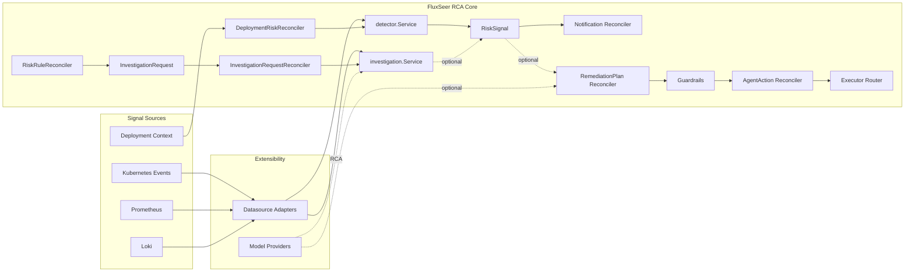

# FluxSeer RCA Architecture Overview

FluxSeer RCA adopts a layered plus split-path architecture.

Product positioning:

```text
Kubernetes-native, evidence-first SRE investigation and risk analysis control plane.
```

Current release scope is narrower than a general AI SRE platform: `v0.3.0-beta.3` is a beta hardening prerelease focused on read-only RCA workflows, canonical preflight semantics, evidence gating, runtime default hardening, and least-privilege RBAC defaults.

The current runnable default path is read-only RCA: evaluate explicit `RiskRule` or `InvestigationRequest` resources, collect bounded evidence, write canonical RCA status, and optionally materialize a `RiskSignal` without mutating the target workload.

The legacy annotation-driven Deployment watcher is retained only as an explicit opt-in path.

Guarded remediation remains a separate optional expansion path. Only when it is explicitly enabled and passes guardrails can a `RiskSignal` lead to a `RemediationPlan`, an `AgentAction`, and an executed side effect.

## Design Goals

- read-only by default
- Kubernetes-native workflow
- operator-first investigation UX
- pluggable datasources
- pluggable model providers
- guarded remediation
- auditable execution
- optional external dependencies

## Dependency Model

FluxSeer RCA treats dependencies in three separate categories:

- runtime dependency: only Kubernetes is required for operator mode; Prometheus, Loki, and external model APIs are optional
- compile-time dependency: controllers and adapters may import Kubernetes or provider-specific packages, but core evaluation and reasoning should stay expressed through FluxSeer RCA domain types
- deployment dependency: FluxSeer RCA manifests install FluxSeer RCA itself, not a full monitoring stack on the user's behalf

That distinction matters because the project goal is integration without structural lock-in.

See [../product-requirements.md](../product-requirements.md) for the product positioning, release-scope, CRD contract, graceful-degradation, evidence-storage, and release-freeze baseline.

See [mermaid-diagrams.md](mermaid-diagrams.md) for maintained Mermaid architecture, relationship, sequence, class, deployment, and release diagrams.

## High-level Architecture

### 1. Signal Sources

FluxSeer RCA accepts signals from multiple systems without hard-coding one observability stack into the core:

- Kubernetes Events
- Prometheus
- Loki
- OpenTelemetry
- deployment metadata and rollout context

This layer answers where risk evidence comes from.

### 2. Datasource Adapter Layer

Datasource adapters live under `internal/datasource`.

Each adapter implements the same contract:

```go
type DataSource interface {
    Name() string
    Type() string
    Capabilities() Capabilities
    Query(ctx context.Context, req QueryRequest) (*QueryResult, error)
    HealthCheck(ctx context.Context) error
}
```

This is the current interface. It is now capability-oriented, so rule evaluation can validate requested query types against adapter support before issuing queries.

Current adapters:

- Prometheus
- Loki
- Kubernetes Events
- OpenTelemetry scaffold
- CloudWatch scaffold

This is the primary extensibility seam for observability integrations. The core detection path depends on the contract, not on provider-specific query code.

See [dependency-neutrality.md](dependency-neutrality.md) for the staged direction toward capabilities, standardized query results, and future datasource resources.

### 3. Detection Service Layer

The legacy annotation-driven runtime uses `DeploymentRiskReconciler` plus `detector.Service`. This watcher is disabled by default and retained as an explicit opt-in path.

Responsibilities:

- watch `Deployment`
- require `fluxseer-rca.aiops.platform/enabled: "true"` for opt-in
- query enabled datasource adapters
- merge evidence by severity and confidence
- produce a normalized `Finding`
- materialize a `RiskSignal`
- trigger notification

This path does not create remediation resources by default.

Key files:

- `internal/controllers/deployment_risk_controller.go`
- `internal/detector/service.go`
- `internal/controllers/risksignal_notification_controller.go`

This layer should continue to consume FluxSeer RCA-owned evidence and domain types rather than pass Kubernetes objects or vendor SDK payloads deep into the system.

### 4. CRD Contract Layer

FluxSeer RCA exposes its workflow through Kubernetes-native CRDs:

- `DataSource`
- `RiskRule`
- `ModelProvider`
- `InvestigationRequest`
- `RiskSignal`
- `RemediationPlan`
- `AgentAction`

`v0.3` keeps `DataSource`, `RiskRule`, and `ModelProvider` as read-only RCA configuration contracts and establishes `InvestigationRequest` as the canonical ad-hoc investigation and RCA status contract.

The API group is `aiops.platform/v1alpha1`.

These CRDs are not only data models. They are workflow state carriers. Each controller advances only the state it owns, so detection, reasoning, approval, and execution do not collapse into one controller.

This gives FluxSeer RCA:

- auditable state transitions
- observable control-plane behavior
- stable contracts for external tooling
- controller-native separation of concerns

### 5. Investigation Experience Layer

The newest architecture step is an operator-first investigation layer.

Implemented contract:

- `InvestigationRequest`

Current responsibility split:

- controller owns request lifecycle and status
- investigation service owns target resolution, evidence gathering, and orchestration
- model gateway owns provider-neutral RCA generation

This layer is intended to support:

- ad-hoc RCA on a workload
- future CLI wrappers
- future thin UI entrypoints
- future webhook or chat bridges

Without this layer, FluxSeer RCA remains background-rule oriented. With it, FluxSeer RCA gains an immediate investigation workflow without becoming a generic agent shell.

### Controller Ownership Boundary

Controllers own Kubernetes workflow state transitions. Shared orchestration should live in internal services rather than controller-to-controller calls.

Expected ownership:

- `RiskRule` controller: resolve targets, validate datasource capability, execute detection queries, and create or update `RiskSignal`
- `InvestigationRequest` controller: resolve targets, collect and normalize evidence, invoke bounded RCA through the model gateway, update terminal status, and optionally emit a discovered `RiskSignal`
- `RiskSignal` controller: manage signal lifecycle and optional downstream guarded planning
- `RemediationPlan` controller: evaluate guardrails and approval state, then create `AgentAction`
- `AgentAction` controller: execute or simulate approved actions and record execution results

Controllers should not run long-lived LLM or tool-use loops in the reconcile path. Future agentic investigation should be delegated to bounded workers or jobs that the controller observes through CRD status.

### 6. Model Gateway Layer

Reasoning and RCA depend on a provider-neutral abstraction rather than a specific LLM vendor.

Provider interface:

```go
type Provider interface {
    Name() string
    Complete(ctx context.Context, req domain.ModelRequest) (domain.ModelResponse, error)
}
```

Current providers:

- heuristic
- openai
- claude
- gemini

The runnable repo defaults to the heuristic provider so the project stays usable without external secrets. The model gateway is a reasoning seam, not an execution authority.

This is the same dependency-neutrality principle as datasources: model vendors are integrations, not core architecture assumptions.

`ModelProvider` covers a single bounded reasoning call over normalized evidence. The supported external provider surface is limited to workload-scoped OpenAI, Claude, and Gemini API credentials.

### Future Investigation Executor Boundary

Deep investigation and remediation proposal flows should use explicit executor contracts rather than expanding `ModelProvider` until it becomes a job orchestrator.

Expected split:

```text
FluxSeer RCA Controller
├─ watch resources and signals
├─ normalize evidence
├─ create and observe InvestigationRequest state
└─ never execute long-running LLM loops

RCA Worker
├─ consume bounded EvidenceBundle
├─ call OpenAI, Claude, Gemini, or heuristic reasoning provider
├─ validate structured output
├─ record token usage and cost
└─ update RCA status

Remediation Worker
├─ checkout an exact commit
├─ create an isolated worktree
├─ generate a patch
├─ run tests and policy checks
├─ create an issue or pull request
└─ never apply directly to production
```

Idempotency should be derived from the request UID, observed generation, evidence digest, executor configuration digest, and repository commit SHA. A controller restart or leader change must not cause the same evidence and configuration to trigger another paid model or agent execution.

### 7. Guardrails Layer

Any transition from risk detection to action planning must pass guardrails.

Responsibilities:

- action allowlist
- protected namespace checks
- severity thresholds
- auto-approve low risk
- require approval for medium and high risk
- reject unsupported or unsafe actions

Guardrails exist so model output cannot directly mutate production state.

### 8. Executor Layer

Executors are isolated from reasoning and policy.

Current executor routes:

- `kubernetes.*`
- `gitops.*`
- `runbook.*`
- `notification.*`

The router is responsible only for dispatch. Safety and approval happen earlier.

The long-term contract for live executors should include:

- dry-run support
- idempotent behavior
- timeout and retry policy
- action result status
- rollback hints
- audit-friendly execution metadata

### 9. Notification and Audit Layer

Notification is an optional `RiskSignal` side effect in the read-only story, and status persistence is part of every workflow stage.

This layer makes sure risk detection and guarded execution both leave an observable trail through:

- webhook notification
- CRD status transitions
- execution summaries
- rollback metadata

## Primary Flow: Background Read-only RCA

The default path is:

```text
RiskRule / Alert / Manual Request
→ InvestigationRequest
→ Bounded Evidence Collection
→ ModelProvider
→ Claim Verification
→ InvestigationRequest.status
→ optional RiskSignal
```

In runtime terms:

1. `DeploymentRiskReconciler` watches `Deployment`.
2. It only processes workloads annotated with `fluxseer-rca.aiops.platform/enabled: "true"`.
3. `detector.Service` queries the enabled adapters.
4. Evidence is merged into a `Finding`.
5. The controller creates or updates a `RiskSignal`.
6. `RiskSignalNotificationReconciler` sends a webhook notification when configured.

This is a legacy bootstrap path. The main open-source entry point is now the `RiskRule` and `InvestigationRequest` path.

## Early Flow: Ad-hoc Read-only Investigation

The early investigation path is:

```text
InvestigationRequest
→ InvestigationRequestReconciler
→ Investigation Service
→ Datasource Adapters
→ Evidence Redaction
→ Model Gateway
→ InvestigationRequest.status
→ optional RiskSignal
```

This path is intended to answer:

```text
Investigate this workload now.
```

It is deliberately separate from:

- recurring rule evaluation
- chat-specific UX
- remediation execution

The CRD is the common contract that CLI and future UI layers call.

## Optional Flow: Guarded Remediation

The remediation path is separate from the detection path:

```text
RiskSignal
→ Model Gateway / Heuristic Reasoner
→ RemediationPlan
→ Guardrails
→ Approval
→ AgentAction
→ Executor
→ Status / Audit
```

This flow is only active when remediation is explicitly enabled.

In runtime terms:

1. `RiskSignalReconciler` derives a `RemediationPlan`.
2. `RemediationPlanReconciler` evaluates the plan through the guardrails engine.
3. Guardrails decide `Approved`, `WaitingApproval`, or `Rejected`.
4. `AgentActionReconciler` currently executes through the legacy `spec.approvedBy` gate and records `status.approval` as the controller-observed projection.
5. Result status is persisted for auditability.

This separation is intentional: risk detection and side-effect execution are not a single direct pipeline.

## CRD Workflow Contract

### `RiskSignal`

Represents a materialized finding with severity, confidence, target, evidence, lineage, notification state, and compatibility RCA projection fields.

### `InvestigationRequest`

Early `v0.3` contract for a human-triggered or system-triggered read-only investigation request.

### `RemediationPlan`

Represents a reviewable mitigation proposal with summary, steps, references, and rollback hints.

### `AgentAction`

Represents one executable action after policy evaluation and, when required, human approval.

Together these CRDs form the workflow contract for the operator:

- `InvestigationRequest` captures ad-hoc investigation intent
- `RiskSignal` captures observation
- `RemediationPlan` captures proposal
- `AgentAction` captures approved execution intent

## Current Implementation Status

Current `v0.3` implementation is intentionally uneven by design.

Implemented and runnable:

- read-only RCA through `InvestigationRequest`
- `RiskRule` to `InvestigationRequest` generation
- optional `RiskSignal` materialization and compatibility projection
- webhook notification
- Prometheus, Loki, and Kubernetes Events demo path

Established as contracts or scaffolds:

- model gateway abstraction
- multiple model provider packages
- guarded remediation controller chain
- multi-backend executor routing

Current `v0.3` investigation layer:

- `InvestigationRequest`
- reusable investigation service orchestration
- thin CLI wrapper over the CRD workflow
- future UI wrappers over the same CRD workflow

Simulation-oriented today:

- most `kubernetes.*` executor behavior
- most `gitops.*` executor behavior
- most `runbook.*` executor behavior

This means FluxSeer RCA should be described today as a read-only RCA control plane with optional `RiskSignal` projection and guarded remediation expansion seams, not as a fully autonomous production remediation system.

## Safety Model

FluxSeer RCA is designed around explicit safety boundaries.

Read-only defaults:

- no workload patching in the default path
- no deployment scaling in the default path
- no rollout pause in the default path
- no remediation resources unless remediation is enabled

Guardrails default to preventing the following:

- modifying protected namespaces
- remediating workloads that are not explicitly opted in
- creating `AgentAction` for non-allowlisted `actionType`
- executing destructive actions before approval policy passes
- allowing the model provider to call the Kubernetes API directly

This safety model is why the read-only track and the remediation track are documented separately.

## Extension Points

FluxSeer RCA is designed to grow through stable seams instead of controller rewrites.

- datasource adapter: add a new observability backend behind the shared datasource contract
- model provider: add or swap a reasoning backend without changing CRD schemas
- executor: add a new action backend behind stable `actionType` routing
- notification channel: extend outbound notification behavior without changing detection semantics

## Mermaid Diagram

The following diagram shows today's runnable control-plane shape, including the early investigation layer.



## What This Means for Open Source Users

FluxSeer RCA can already be described externally as:

`FluxSeer RCA is a Kubernetes-native SRE investigation control plane with explicit recurring detection, ad-hoc read-only investigation workflows, and optional AI-assisted reasoning.`

It should not yet be described as:

`FluxSeer RCA fully automates AI remediation in production.`

That distinction matters because the default path is intentionally safe, Kubernetes-native, and easy to validate, while guarded remediation is an opt-in and audited expansion path.

The conservative release label is `v0.3.0-beta.3 RCA beta hardening`.
