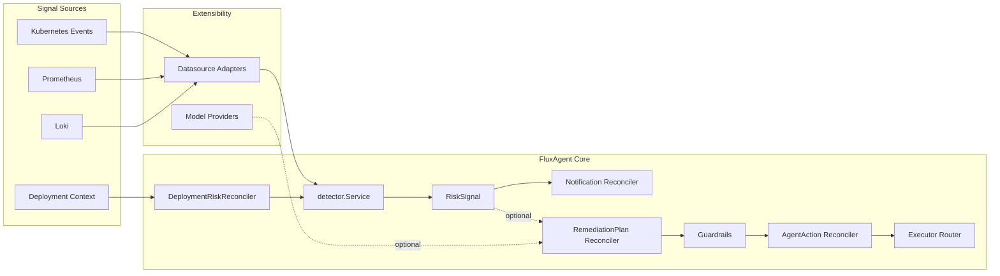

# FluxAgent Architecture Overview

FluxAgent is a Kubernetes-native AI SRE Agent Operator with two runtime tracks:

- `v0.1 read-only`: detect risk and notify
- `guarded remediation`: propose and optionally execute guarded actions

The default runtime path is read-only.

## Layered View

### 1. Signal Sources

FluxAgent is designed to accept signals from multiple systems without hard-coding one stack into the core:

- Kubernetes Events
- Prometheus
- Loki
- OpenTelemetry
- deployment metadata and rollout context

These systems are accessed through datasource adapters rather than direct platform coupling.

### 2. Datasource Adapter Layer

Datasource adapters live under `internal/datasource`.

Each adapter implements the same contract:

```go
type DataSource interface {
    Name() string
    Type() domain.QueryType
    Query(ctx context.Context, req QueryRequest) (*QueryResult, error)
    HealthCheck(ctx context.Context) error
}
```

Current adapters:

- Prometheus
- Loki
- Kubernetes Events
- OpenTelemetry scaffold
- CloudWatch scaffold

This is the main extensibility seam for observability integrations.

### 3. Read-only Detection Layer

The default `v0.1` runtime uses `DeploymentRiskReconciler` plus `detector.Service`.

Flow:

1. Watch `Deployment`
2. Check `fluxagent.aiops.platform/enabled: "true"`
3. Query enabled datasource adapters
4. Merge evidence
5. Produce a `Finding`
6. Materialize a `RiskSignal`
7. Notify via webhook

This path does not create remediation resources by default.

Key files:

- `internal/controllers/deployment_risk_controller.go`
- `internal/detector/service.go`
- `internal/controllers/risksignal_notification_controller.go`

### 4. CRD Contract Layer

FluxAgent exposes its core workflow through Kubernetes-native CRDs:

- `RiskSignal`
- `RemediationPlan`
- `AgentAction`

These resources are the platform API for higher-level automation and external tooling.

The API group is `aiops.platform/v1alpha1`.

### 5. Model Gateway Layer

Reasoning and RCA should depend on provider-neutral abstractions instead of a specific LLM vendor.

Provider interface:

```go
type Provider interface {
    Name() string
    Complete(ctx context.Context, req domain.ModelRequest) (domain.ModelResponse, error)
}
```

Current providers:

- heuristic
- openai scaffold
- claude scaffold
- gemini scaffold
- bedrock scaffold
- local scaffold

Today, the runtime defaults to the heuristic provider so the project stays runnable without external secrets.

### 6. Guardrails Layer

Any transition from risk detection to action planning must pass guardrails.

Responsibilities:

- action allowlist
- protected namespace checks
- severity thresholds
- auto-approve low risk
- require approval for medium/high risk
- reject unsupported or unsafe actions

This layer exists so AI reasoning does not directly mutate production state.

### 7. Executor Layer

Executors are split from reasoning and policy.

Current executor routes:

- `kubernetes.*`
- `gitops.*`
- `runbook.*`
- `notification.*`

The router is responsible only for dispatch. Safety and approval happen earlier.

## Runtime Modes

### Default: Read-only

Enabled by default in `cmd/manager`.

Behavior:

- create `RiskSignal`
- notify webhook
- no remediation resources

### Optional: Guarded Remediation

Enabled only with `--enable-remediation=true`.

Behavior:

- `RiskSignal` may create `RemediationPlan`
- guardrails assess plan
- `AgentAction` is created only through guarded flow
- execution is routed through adapters

## Mermaid Diagram



## What This Means for Open Source Users

FluxAgent can already be described externally as:

`FluxAgent v0.1 is a read-only RiskSignal Operator.`

It should not yet be described as:

`FluxAgent fully automates AI remediation in production.`

That distinction is important because the read-only path is intentionally safe, operator-native, and easy to demo, while the guarded remediation path is still an expansion track rather than the primary entry point.
