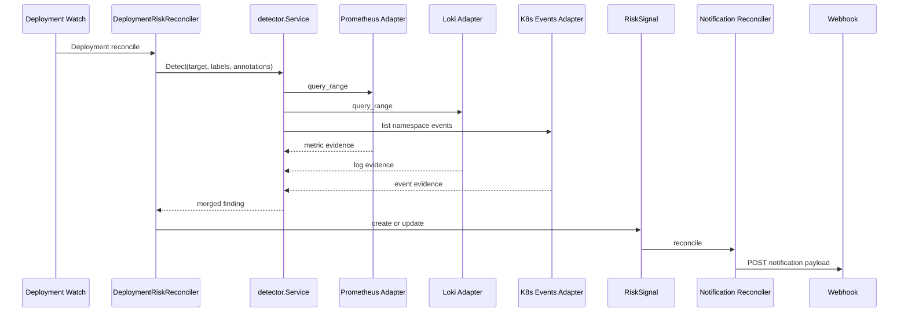

# Read-only RiskSignal Flow

This document describes the default `v0.1` runtime path. This is the path that should be treated as the main open-source entry point.

## Goal

Turn Kubernetes-native and observability signals into a `RiskSignal` plus notification without mutating the target workload.

## Runtime Entry

The read-only path is started by [cmd/manager/main.go](/Users/czhuang/Chongzhe-workspace/HomeLab/FluxSeer/FluxAgent/cmd/manager/main.go:1) through [internal/operatorapp/run.go](/Users/czhuang/Chongzhe-workspace/HomeLab/FluxSeer/FluxAgent/internal/operatorapp/run.go:1).

Default behavior:

- register Kubernetes Events adapter unconditionally
- register Prometheus adapter when `FLUXAGENT_PROMETHEUS_URL` is set
- register Loki adapter when `FLUXAGENT_LOKI_URL` is set
- register webhook notification controller when `FLUXAGENT_WEBHOOK_URL` is set
- keep remediation disabled unless `--enable-remediation=true`

## Resource Selection

The controller watches all `Deployment` resources, but detection only runs for workloads annotated with:

```yaml
metadata:
  annotations:
    fluxagent.aiops.platform/enabled: "true"
```

Optional per-workload annotations:

- `fluxagent.aiops.platform/prometheus-query`
- `fluxagent.aiops.platform/prometheus-threshold`
- `fluxagent.aiops.platform/loki-query`
- `fluxagent.aiops.platform/event-keywords`

See [examples/sample-app/deployment.yaml](/Users/czhuang/Chongzhe-workspace/HomeLab/FluxSeer/FluxAgent/examples/sample-app/deployment.yaml:1).

## Control Flow

1. `DeploymentRiskReconciler` reads the target `Deployment`.
2. It copies labels and annotations into a detector request.
3. `detector.Service` queries the registered datasource adapters.
4. Findings from Prometheus, Loki, and Kubernetes Events are merged by severity and confidence.
5. A `RiskSignal` object is created or updated.
6. `RiskSignalNotificationReconciler` sends a webhook notification once.
7. The `RiskSignal` status moves to `Confirmed`, then `Notified` when webhook delivery succeeds.

## Signal Semantics

Current built-in detection logic:

- Prometheus:
  metric threshold breach produces a medium-severity finding
- Loki:
  any matching error log produces a medium-severity finding
- Kubernetes Events:
  matching event keywords such as `backoff`, `oomkilled`, `unhealthy`, `failed` produce a high-severity finding

The merged result keeps the highest severity and highest confidence while attaching all evidence records.

## RiskSignal Output

The generated `RiskSignal` currently contains:

- target resource reference
- signal type
- severity
- confidence
- `dryRun: true`
- TTL
- evidence list
- default read-only action metadata:
  `actionType: notification.sendSlack`

That last field is a contract placeholder. It allows downstream guarded flows to reuse the same CRD shape without meaning that production remediation has already happened.

## Sequence Diagram



## Safety Boundary

This mode does not:

- patch workloads
- scale deployments
- pause rollouts
- create `RemediationPlan`
- create `AgentAction`

That boundary is the reason `v0.1` is safe to describe publicly as a read-only operator.
