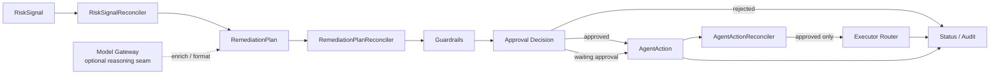

# Guarded Remediation Flow

This document describes the optional path that starts after a `RiskSignal` exists and `--enable-remediation=true` is enabled.

## Goal

Turn a risk observation into a reviewable remediation plan, then into a guarded `AgentAction`.

## Enablement

Remediation controllers are only active when the manager is started with:

```bash
GOWORK=off go run ./cmd/manager --enable-remediation=true
```

The wiring lives in [internal/operatorapp/run.go](../../internal/operatorapp/run.go).

## Flow Summary

The remediation path is:

```text
RiskSignal
→ Plan Derivation
→ RemediationPlan
→ Guardrails
→ Approval
→ AgentAction
→ Executor
→ Status / Audit
```

This is a separate, opt-in control path. Detection and execution are not a single direct pipeline.

## Controller Chain

### 1. `RiskSignalReconciler`

Source: [internal/controllers/risksignal_controller.go](../../internal/controllers/risksignal_controller.go)

Responsibilities:

- watch `RiskSignal`
- derive one `RemediationPlan`
- carry over severity, confidence, TTL, target, and evidence references
- build an initial step from `spec.actionType`

Current posture:

- plan derivation is controller-driven in the current repo
- richer reasoning through the model gateway is an intended seam, not a required runtime dependency for `v0.1`

### 2. `RemediationPlanReconciler`

Source: [internal/controllers/remediationplan_controller.go](../../internal/controllers/remediationplan_controller.go)

Responsibilities:

- evaluate the proposed step through the guardrails engine
- create one `AgentAction`
- attach dry-run result and rollback plan
- set plan and action status to `Approved`, `WaitingApproval`, or `Rejected`

### 3. `AgentActionReconciler`

Source: [internal/controllers/agentaction_controller.go](../../internal/controllers/agentaction_controller.go)

Responsibilities:

- hold unapproved actions in `WaitingApproval`
- execute approved actions through the executor router
- persist `Executing`, `Succeeded`, or `Failed`

## Decision Boundary

The main safety boundary is in [internal/guardrails/engine.go](../../internal/guardrails/engine.go).

Current policy behavior:

- reject action types that are not in the allowlist
- auto-approve low-severity actions
- require manual approval for medium and high severity
- require manual approval for high severity against protected namespaces
- reject unsupported or unsafe severities

Guardrails also exist to prevent:

- direct model-to-cluster mutation
- non-allowlisted action routing
- bypass of approval on destructive or higher-risk actions
- remediation against protected targets without explicit policy allowance

Default allowlisted action types:

- `kubernetes.scaleDeployment`
- `kubernetes.rolloutPause`
- `kubernetes.rolloutRestart` (v0.5-alpha.1 allowlisted slice)
- `gitops.createPullRequest`
- `runbook.triggerWorkflow`
- `notification.sendSlack`

## Status Model

Typical status progression:

1. `RiskSignal`: `Confirmed` or `Notified`
2. `RiskSignal`: `ReadyForApproval`
3. `RemediationPlan`: `Approved` or `WaitingApproval` or `Rejected`
4. `AgentAction`: `Approved` or `WaitingApproval` or `Rejected`
5. `AgentAction`: `Executing`
6. `AgentAction`: `Succeeded` or `Failed`

The CRDs in this flow are workflow state carriers, not passive records. Each controller owns one state transition boundary.

## Architecture Diagram



## Important Limitation

This path exists and is testable, but the executors are still simulation-oriented. The repo exposes the contracts, policy seams, and controller flow before claiming production-grade autonomous remediation.
